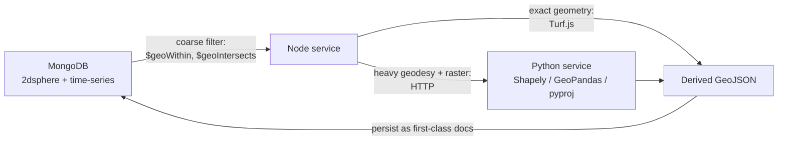

# 02 — Technical Requirements Document (TRD)

**Product:** VARUNA
**Problem Statement:** SIH26143
**Stack mandate:** MERN (MongoDB · Express · React · Node.js) + a Python ML/geospatial service
**Document version:** 1.0

---

## 2.1 Scope of this document

The PRD says *what* and *why*. This document says *how*, at the level of technology
choices, data contracts, algorithms, budgets, and constraints. It is the contract between
the four workstreams (frontend, backend, ML, DevOps). It also carries the complete
**API key register** in [§2.14](#214-api-key-register-summary), mirrored in expanded form in
[11_API_KEYS_and_External_Services.md](11_API_KEYS_and_External_Services.md).

---

## 2.2 Technology Stack — decisions and rationale

### 2.2.1 Client

| Concern | Choice | Version | Why this and not the alternative |
|---|---|---|---|
| Framework | React | 18.3 | Mandated by MERN. Concurrent features matter for keeping the map responsive while heavy panels re-render. |
| Language | TypeScript | 5.5 | Geospatial code is full of `[lon, lat]` vs `[lat, lon]` bugs. Branded types (`Longitude`, `Latitude`) catch them at compile time. |
| Build | Vite | 5.x | Fast HMR; CRA is deprecated; Next.js SSR buys us nothing for an authenticated WebGL workstation. |
| Routing | React Router | 6.26 | Nested routes map cleanly onto the workspace layout. |
| Server state | TanStack Query | 5.x | Caching, background refetch, and request dedup for expensive geo queries. |
| Client state | Zustand | 4.x | Map/time/layer state is high-frequency; Redux boilerplate is not justified. Zustand with `subscribeWithSelector` avoids re-rendering the map on every tick. |
| Map engine | MapLibre GL JS | 4.x | Open source fork of Mapbox GL v1; no mandatory token; supports raster, vector, terrain, 3D pitch. |
| Large data viz | deck.gl | 9.x | WebGL layers that render 10^5–10^6 AIS points and animated tracks (`TripsLayer`) at 60 fps. SVG/Canvas cannot. |
| 3D | react-three-fiber + drei | R3F 8.x | Declarative Three.js; used for the globe, the 3D slick relief, and the hero. |
| Motion | Framer Motion | 11.x | Layout animations, shared element transitions, spring physics. |
| Scroll choreography | GSAP + ScrollTrigger | 3.12 | Only on the public/landing surface. |
| Charts | Visx + custom SVG | 3.x | Evidence waterfalls and timelines need bespoke marks; a chart library would fight us. |
| Styling | Tailwind CSS + CSS custom properties | 3.4 | Tokens live in CSS variables (theme-switchable); Tailwind consumes them. |
| Forms | React Hook Form + Zod | — | Same Zod schemas shared with the server. |
| Tests | Vitest + Testing Library + Playwright | — | Unit, component, E2E. |

### 2.2.2 API server

| Concern | Choice | Why |
|---|---|---|
| Runtime | Node.js 20 LTS | MERN "N"; native fetch, stable test runner. |
| Framework | Express 5 | MERN "E"; Express 5 finally handles async errors natively. |
| Language | TypeScript 5.5 | Shared types with the client via a `packages/shared` workspace. |
| ODM | Mongoose 8 | Schema validation, GeoJSON types, time-series collection support. |
| Validation | Zod | One schema, used for runtime validation and TS types, shared client/server. |
| Queue | BullMQ 5 on Redis 7 | Long jobs (ingest, inference, drift) must not run in a request. Retries, backoff, DLQ, progress events. |
| Realtime | Socket.IO 4 | Job progress, live AIS push, collaborative presence. Falls back to polling on hostile networks. |
| Auth | jose (JWT) + argon2id | Argon2id is the current password-hashing recommendation over bcrypt. |
| Logging | pino + pino-http | Structured JSON logs with request IDs. |
| Geometry | Turf.js (@turf/*) | Buffer, distance, along, nearestPointOnLine, simplify — the PostGIS functions MongoDB lacks. |
| Docs | OpenAPI 3.1 generated from Zod (`zod-to-openapi`) | Spec cannot drift from implementation. |
| PDF | Playwright (headless Chromium) | Renders the real report route; identical typography to the app. |

### 2.2.3 ML / Geospatial service

| Concern | Choice | Why |
|---|---|---|
| Runtime | Python 3.11 | The entire geospatial and DL ecosystem lives here. Node has no equivalent of rasterio/GDAL/GeoPandas. |
| API | FastAPI + Uvicorn | Async, Pydantic validation, auto OpenAPI. |
| DL | PyTorch 2.4 + `segmentation_models_pytorch` | Standard; gives U-Net / U-Net++ / DeepLabV3+ with pretrained encoders behind one API. |
| Transformers | `transformers` (SegFormer) | Second architecture for comparison. |
| Raster I/O | rasterio + GDAL | COG read/write, windowed reads, affine transforms, reprojection. |
| SAR preprocessing | ESA SNAP (`snappy` / `gpt` graphs) or pre-processed RTC from Planetary Computer | SNAP is the reference implementation for Sentinel-1. RTC lets us skip it when available. |
| Vector | Shapely 2 + GeoPandas + pyproj | Polygonisation, geodesic area, morphology. |
| Drift | OpenDrift (`OceanDrift` / `OpenOil`) | MET Norway's operational Lagrangian model; supports backward integration natively. |
| Env data | `copernicusmarine` toolbox, `cdsapi`, xarray + netCDF4 | Official clients for CMEMS and ERA5. |
| Tiles | TiTiler (`titiler.application`) | Serves XYZ/WMTS directly from COGs in S3. |
| Tracking | MLflow (self-hosted) or Weights & Biases | Experiment provenance is part of the real-data policy. |

### 2.2.4 Data and infrastructure

| Concern | Choice | Why |
|---|---|---|
| Primary DB | MongoDB 7 (Atlas M0 for demo, M10+ for production) | MERN "M". GeoJSON native, `2dsphere` index, time-series collections. |
| Cache / queue backend | Redis 7 (Upstash or self-hosted) | BullMQ backend, session/rate-limit store, tile metadata cache. |
| Object storage | S3-compatible — Cloudflare R2 (prod), MinIO (local) | R2 has zero egress fees, which matters for serving 1 GB scenes and tiles. |
| Containers | Docker + docker compose (dev), Docker + Fly.io/Render/Railway (deploy) | Reproducible cold start is a release criterion. |
| CI | GitHub Actions | Lint, typecheck, test, secret scan, real-data policy check. |
| Monitoring | Sentry (errors) + pino → Grafana Loki (logs) | — |

---

## 2.3 System-level technical requirements

| ID | Requirement |
|---|---|
| TR-1 | All internal timestamps are ISO-8601 UTC with explicit `Z`. No naive datetimes cross a service boundary. |
| TR-2 | All stored geometry is GeoJSON in **EPSG:4326**, coordinate order `[longitude, latitude]`, right-hand-rule winding for polygons. |
| TR-3 | All *measurement* (area, length, distance) is performed either geodesically (WGS84 ellipsoid, via `pyproj.Geod` / Turf) or on a locally appropriate equal-area projection. Never in degrees. |
| TR-4 | Every persisted derived object carries `provenance` (see §2.7) and `pipelineVersion`. |
| TR-5 | Every long-running operation is a queued job with an ID, progress stream, cancel path, and a terminal state. No synchronous request may exceed 10 s. |
| TR-6 | Services communicate over HTTP/JSON internally, authenticated by a shared service token; the Python service is never exposed publicly. |
| TR-7 | The client never holds a third-party data-provider credential. All external provider calls are proxied by the Node server. |
| TR-8 | All external provider calls pass through a single `ExternalClient` wrapper with retry, exponential backoff, circuit breaker, quota accounting, and response caching. |
| TR-9 | Any module that cannot obtain real data returns an explicit `UNAVAILABLE` status with a machine-readable reason. It must not return placeholder values. |
| TR-10 | Model artefacts are content-addressed (SHA-256) and the hash is recorded in every inference result. |

---

## 2.4 Canonical data contracts

These are the shapes that cross service boundaries. They are defined once in
`packages/shared/src/schemas/*.ts` with Zod and mirrored in Pydantic.

### 2.4.1 `Provenance`

```ts
const Provenance = z.object({
  sourceType: z.enum([
    'SATELLITE_SCENE', 'AIS_ARCHIVE', 'AIS_API', 'AIS_STREAM',
    'OCEAN_MODEL', 'ATMOSPHERIC_MODEL', 'COASTLINE_VECTOR',
    'VESSEL_REGISTRY', 'HUMAN_ANNOTATION', 'DERIVED'
  ]),
  provider: z.string(),          // e.g. 'Copernicus Data Space Ecosystem'
  datasetId: z.string(),         // e.g. 'SENTINEL-1' / 'GLOBAL_ANALYSISFORECAST_PHY_001_024'
  externalId: z.string(),        // e.g. the exact scene product ID
  retrievedAt: z.string().datetime(),
  licence: z.string(),           // e.g. 'Copernicus Sentinel Data 2023'
  accessUrl: z.string().url().optional(),
  checksum: z.string().optional(),          // SHA-256 of the raw artefact
  derivedFrom: z.array(z.string()).default([]), // provenance IDs of parents
  processingManifestId: z.string().optional(),
});
```

> **Enforcement:** there is no `MOCK`, `SYNTHETIC`, `DEMO` or `TEST` member of
> `sourceType`. A document without a valid `provenance` fails Mongoose validation and is
> rejected by the API serialiser.

### 2.4.2 `SatelliteScene`

```ts
{
  _id, investigationId?, 
  platform: 'SENTINEL-1A'|'SENTINEL-1B'|'SENTINEL-1C'|'SENTINEL-2A'|'SENTINEL-2B'|'LANDSAT-8'|'LANDSAT-9'|'OTHER',
  sensor: 'SAR-C'|'MSI'|'OLI',
  productId: string,                    // exact provider product identifier
  mode: 'IW'|'EW'|'SM'|null,
  polarisations: ('VV'|'VH'|'HH'|'HV')[],
  orbitDirection: 'ASCENDING'|'DESCENDING',
  relativeOrbit: number|null,
  acquiredAt: Date,                     // UTC, from provider metadata only
  footprint: GeoJSONPolygon,            // EPSG:4326
  crs: string,                          // e.g. 'EPSG:32643'
  gsdMeters: number,
  cloudCoverPct: number|null,           // optical only
  storage: { bucket, key, cogKey, sizeBytes, checksum },
  stacItem: object,                     // verbatim provider STAC/OData record
  processing: ProcessingManifest,
  provenance: Provenance,
  status: 'CATALOGUED'|'DOWNLOADING'|'PREPROCESSING'|'READY'|'FAILED'
}
```

### 2.4.3 `SpillDetection`

```ts
{
  _id, sceneId, investigationId,
  geometry: GeoJSONPolygon | GeoJSONMultiPolygon,  // EPSG:4326, RHR-wound
  areaKm2: number,                 // geodesic
  perimeterKm: number,
  morphology: {
    majorAxisKm, minorAxisKm, elongationRatio,
    orientationDeg,               // bearing of major axis, 0-180
    convexity, centroid: GeoJSONPoint, boundingBox
  },
  model: { name, version, artefactSha256, inputBands, tileSize, overlap },
  confidence: {
    meanOilProbability, minOilProbability, maxOilProbability,
    lookAlikeCompetition,         // mean prob of look_alike class inside polygon
    windSuitability,              // 0-1 from wind speed at acquisition
    overall                       // combined, documented formula in 07_AIML
  },
  classCounts: { sea, oil_spill, look_alike, ship, land },  // pixel counts
  maskKey: string,                 // object-storage key of the class raster (COG)
  probabilityKey: string,          // per-class probability raster (COG)
  reviewStatus: 'UNREVIEWED'|'CONFIRMED'|'REJECTED'|'EDITED',
  reviewHistory: [{ userId, action, at, note, geometryBefore }],
  provenance: Provenance
}
```

### 2.4.4 `AisPosition` (MongoDB **time-series** collection)

```ts
// timeField: 't', metaField: 'meta', granularity: 'seconds'
{
  t: Date,                        // UTC position timestamp
  meta: {
    mmsi: number,
    source: 'MARINE_CADASTRE'|'DMA_DK'|'KYSTVERKET_NO'|'GFW'|'AISSTREAM'|'USER_UPLOAD',
    ingestBatchId: string
  },
  position: { type: 'Point', coordinates: [lon, lat] },
  sog: number|null,               // knots
  cog: number|null,               // degrees true, 0-359.9
  heading: number|null,           // degrees true
  rot: number|null,               // rate of turn
  navStatus: number|null,         // ITU-R M.1371 nav status code
  draught: number|null,
  quality: { flags: string[], impliedSpeedKn: number|null }
}
```

### 2.4.5 `VesselTrack`

```ts
{
  _id, investigationId, mmsi,
  imo: number|null, name: string|null, callsign: string|null,
  shipType: number|null, shipTypeLabel: string|null, flag: string|null,
  dimensions: { toBow, toStern, toPort, toStarboard, lengthM, beamM }|null,
  windowStart: Date, windowEnd: Date,
  segments: [{
    startAt, endAt, pointCount,
    geometry: GeoJSONLineString,        // ordered, EPSG:4326
    lengthKm, meanSogKn, maxSogKn
  }],
  gaps: [{ startAt, endAt, durationMin, fromPoint, toPoint, straightLineKm, impliedSpeedKn }],
  quality: {
    flags: ('AIS_GAP'|'POSITION_JUMP'|'MMSI_INVALID'|'MMSI_DUPLICATE'|'STATIC_MISMATCH'|'LOW_SAMPLING')[],
    completeness: number,               // 0-1
    medianSamplingIntervalSec: number,
    removedOutlierCount: number
  },
  provenance: Provenance
}
```

### 2.4.6 `OriginEstimate`

```ts
{
  _id, investigationId, detectionId,
  method: 'LAGRANGIAN_BACKTRACK'|'FOOTPRINT_PROXIMITY',
  status: 'OK'|'DEGRADED'|'UNAVAILABLE',
  degradationReason: string|null,
  forcing: {
    currents: { provider, datasetId, resolutionDeg, temporalResolutionH, provenanceId }|null,
    winds:    { provider, datasetId, resolutionDeg, temporalResolutionH, provenanceId }|null
  },
  params: {
    particleCount, timeStepMinutes, horizonHours,
    windDriftCoefficientRange: [number, number],
    ekmanDeflectionRangeDeg: [number, number],
    horizontalDiffusivity
  },
  releaseWindow: { earliest: Date, latest: Date, mostLikelyStart: Date, mostLikelyEnd: Date },
  originField: {
    // time-indexed KDE surfaces
    frames: [{ atTime: Date, gridKey: string, bounds, cellSizeDeg }],
    support90: GeoJSONPolygon,       // 90% probability contour at mostLikely time
    support50: GeoJSONPolygon,
    centroid: GeoJSONPoint
  },
  provenance: Provenance
}
```

### 2.4.7 `CandidateVessel`

```ts
{
  _id, investigationId, detectionId, originEstimateId, trackId, mmsi,
  score: number,                       // 0-100
  scoreCI: [number, number],           // bootstrap 90% interval
  tier: 'STRONG'|'MODERATE'|'WEAK'|'INSUFFICIENT_EVIDENCE',
  rank: number,
  features: [{
    key: string,                       // e.g. 'spatial_proximity'
    rawValue: number|null,
    rawUnit: string,
    normalised: number|null,           // 0-1
    weight: number,
    contribution: number,              // weight * normalised, in score points
    status: 'MEASURED'|'MISSING'|'NOT_APPLICABLE',
    evidenceRefs: [{ kind, id, at }]   // drill-down to source records
  }],
  weightProfileId: string,
  modelVersion: string,
  excluded: { by, at, reason }|null,
  provenance: Provenance
}
```

---

## 2.5 MongoDB schema, indexing and partitioning

### 2.5.1 Collections

| Collection | Type | Est. volume | Key indexes |
|---|---|---|---|
| `users` | standard | 10^2 | `{email:1}` unique |
| `organisations` | standard | 10^1 | — |
| `investigations` | standard | 10^4 | `{orgId:1, createdAt:-1}`, `{aoi:'2dsphere'}` |
| `satellite_scenes` | standard | 10^5 | `{productId:1}` unique, `{footprint:'2dsphere'}`, `{acquiredAt:-1}` |
| `spill_detections` | standard | 10^5 | `{geometry:'2dsphere'}`, `{sceneId:1}`, `{investigationId:1}` |
| `ais_positions` | **time-series** | 10^9 | `{'meta.mmsi':1, t:1}`, `{position:'2dsphere'}`, `{t:1}` |
| `vessels` | standard | 10^6 | `{mmsi:1}` unique, `{imo:1}` sparse, Atlas Search on `name` |
| `vessel_tracks` | standard | 10^6 | `{investigationId:1, mmsi:1}`, `{'segments.geometry':'2dsphere'}` |
| `origin_estimates` | standard | 10^5 | `{detectionId:1}`, `{'originField.support90':'2dsphere'}` |
| `candidate_vessels` | standard | 10^6 | `{investigationId:1, rank:1}`, `{mmsi:1}` |
| `reports` | standard | 10^4 | `{investigationId:1, createdAt:-1}` |
| `jobs` | standard | 10^6 | `{status:1, createdAt:-1}`, TTL on completed |
| `audit_log` | standard, append-only | 10^7 | `{actorId:1, at:-1}`, `{entityType:1, entityId:1}` |
| `provenance_records` | standard, immutable | 10^7 | `{externalId:1}`, `{sourceType:1, retrievedAt:-1}` |

### 2.5.2 Time-series collection for AIS — the critical decision

```js
db.createCollection('ais_positions', {
  timeseries: { timeField: 't', metaField: 'meta', granularity: 'seconds' },
  expireAfterSeconds: null            // retained; archived to object storage by policy
});
db.ais_positions.createIndex({ 'meta.mmsi': 1, t: 1 });
db.ais_positions.createIndex({ position: '2dsphere' });
```

Rationale: AIS is the highest-cardinality data in the system (a single busy strait
produces tens of millions of positions per month). MongoDB time-series collections bucket
documents by `metaField` and time, giving order-of-magnitude storage reduction and much
faster range scans than a standard collection. The `metaField` **must** be `mmsi` because
every query we run is "this vessel, this time range" or "this box, this time range".

### 2.5.3 Partitioning strategy

Beyond ~5·10^8 documents we shard `ais_positions` on a compound key
`{ 'meta.mmsi': 'hashed', t: 1 }`, and archive positions older than 24 months to Parquet
in object storage with a manifest in `provenance_records` so historical investigations
remain reproducible.

---

## 2.6 The MongoDB-versus-PostGIS trade-off (mandatory reading)

The problem statement's original outline proposed PostgreSQL + PostGIS. The build mandate
is MERN. This section states precisely what we lose, what we keep, and how we compensate —
because pretending MongoDB is PostGIS would produce a system that silently computes wrong
distances.

### 2.6.1 What MongoDB gives us natively

| Capability | MongoDB operator | Used for |
|---|---|---|
| Point-in-polygon | `$geoWithin` | AIS positions inside the search envelope |
| Geometry intersection | `$geoIntersects` | Tracks crossing the origin support polygon |
| Nearest-neighbour (points) | `$near` / `$nearSphere` / `$geoNear` | Nearest AIS ping to a coordinate |
| Spherical distance to a point | `$geoNear` `distanceField` | Ranked proximity queries |
| Spherical indexing | `2dsphere` | All of the above at scale |

### 2.6.2 What MongoDB does **not** have

| Missing capability | PostGIS equivalent | Consequence if faked |
|---|---|---|
| Distance from a point to a **polygon edge** | `ST_Distance` | Using centroid distance overstates proximity for large slicks — a direct source of false attribution |
| Buffering a geometry | `ST_Buffer` | Cannot build the search envelope in-database |
| Geodesic length along a line | `ST_Length(geography)` | Track length and along-track position wrong |
| Nearest point on a line to a point | `ST_ClosestPoint` | Cannot compute true track-to-origin distance |
| Union / dissolve | `ST_Union` | Cannot merge multi-part slicks |
| Simplification | `ST_Simplify` | Payload bloat |
| Geodesic area | `ST_Area(geography)` | Area in square degrees is meaningless |
| Spatial joins | `JOIN ... ON ST_DWithin` | No set-based correlation |

### 2.6.3 The compensation architecture



**The rule:** MongoDB performs the *coarse spatial filter* (cheap, indexed, reduces
millions of rows to hundreds). Exact geometry is then computed in Turf.js or Shapely and
**written back** into MongoDB as derived, indexed GeoJSON documents so subsequent queries
are again index-accelerated.

| Operation | Where it runs | Library / function |
|---|---|---|
| Build search envelope | Node | `turf.buffer(support90, radiusKm, {units:'kilometers'})` |
| Envelope query | MongoDB | `{ position: { $geoWithin: { $geometry: envelope } }, t: { $gte, $lte } }` |
| Track-to-origin minimum distance | Node | `turf.pointToLineDistance` / `turf.nearestPointOnLine` |
| Track length | Node | `turf.length(line, {units:'kilometers'})` |
| Geodesic slick area | Python | `pyproj.Geod.geometry_area_perimeter` |
| Slick morphology (axes, orientation) | Python | Shapely `minimum_rotated_rectangle`, PCA on boundary |
| Simplification | Python at write time | `shapely.simplify(tol)`, tolerance recorded in the document |
| Origin KDE grid | Python | `scipy.stats.gaussian_kde` → GeoTIFF → contour to polygon |
| Polygon-to-polygon intersection area | Python | Shapely `intersection` on an equal-area projection |

### 2.6.4 Correctness guardrails

- A unit-test suite of **known-answer geodesic cases** (e.g. distance London→New York =
  5,570 km ± 5 km; area of a 1° × 1° cell at the equator ≈ 12,308 km²) runs in CI against
  both the Turf and pyproj paths.
- Any function returning a distance or area must accept and return an explicit unit type
  (`Kilometres`, `SquareKilometres` branded types). Bare `number` is rejected in review.
- `$near` is never used against a polygon. Lint rule enforces it.

---

## 2.7 Provenance and the real-data enforcement layer

Technical requirements that implement [13_REAL_DATA_POLICY](13_REAL_DATA_POLICY.md):

| ID | Requirement |
|---|---|
| TR-P1 | Every Mongoose model that stores observed or derived data has a required `provenance` sub-document referencing an immutable `provenance_records` entry. |
| TR-P2 | A global Mongoose `pre('validate')` hook rejects saves where `provenance` is absent or where `sourceType` is not in the allowed enum. |
| TR-P3 | The API response serialiser strips and logs any object lacking provenance rather than emitting it. |
| TR-P4 | The React `<DataObject>` boundary component renders a visible `PROVENANCE MISSING` error state instead of the data. This is deliberately ugly. |
| TR-P5 | No `faker`, `chance`, `casual`, `@faker-js/faker` or equivalent may appear in `dependencies` of any runtime package. CI fails on their presence outside `devDependencies` of test-only packages. |
| TR-P6 | Fixture files used in tests live under `**/__fixtures__/real/` and are **captured real responses** with their provenance recorded, not hand-authored. A CI check asserts every fixture has a sibling `.provenance.json`. |
| TR-P7 | The ML training pipeline refuses to start if any input manifest entry lacks a dataset citation and licence string. |
| TR-P8 | Any UI number that is not directly measured must be labelled `estimated` with its method, or `unavailable`. There is no third option. |

---

## 2.8 Algorithms — technical specification summary

Full derivations live in [07_AIML_Specification.md](07_AIML_Specification.md). This is the
contract-level summary.

### 2.8.1 SAR preprocessing chain (Sentinel-1 GRD)

| Step | Tool | Parameter | Recorded in manifest |
|---|---|---|---|
| 1. Apply orbit file | SNAP `Apply-Orbit-File` | Precise (POEORB) if available, else restituted | orbit file name |
| 2. Thermal noise removal | SNAP `ThermalNoiseRemoval` | per polarisation | yes |
| 3. Border noise removal | SNAP `Remove-GRD-Border-Noise` | threshold 0.5 | yes |
| 4. Radiometric calibration | SNAP `Calibration` | output sigma-nought | yes |
| 5. Speckle filter | SNAP `Speckle-Filter` | Refined Lee, 7×7 | filter + window |
| 6. Terrain correction | SNAP `Terrain-Correction` | Range-Doppler, SRTM 1Sec HGT, 10 m pixel | DEM name |
| 7. dB conversion | `10 * log10(sigma0)` | — | yes |
| 8. COG conversion | `rio cogeo create` | deflate, 512 blocks, overviews | yes |

If Microsoft Planetary Computer **Sentinel-1 RTC** is used, steps 1–6 are provider-side;
the manifest records `preprocessing: 'MPC_RTC'` and the provider's own processing metadata.

### 2.8.2 Segmentation

- **Input:** 256×256 tiles, stride 192 (25% overlap), channels = `[VV_dB, VH_dB, VV/VH ratio]`
  normalised by per-scene robust scaling (2nd–98th percentile).
- **Architectures compared:** U-Net (ResNet-34), U-Net++ (ResNet-34), DeepLabV3+ (ResNet-50), SegFormer-B2.
- **Loss:** `0.5 * DiceLoss + 0.5 * FocalLoss(gamma=2)` with class weights inversely
  proportional to pixel frequency — oil is typically < 2% of pixels.
- **Output blending:** cosine-window weighted average over overlapping tiles, eliminating
  tile seams.
- **Thresholding:** argmax over classes; oil polygons additionally require
  `meanOilProbability >= 0.60` and `areaKm2 >= 0.05` (about 500 pixels at 10 m).

### 2.8.3 Backward drift

Discrete backward Euler step per particle `i` at time `t`:

```
u_i(t) = u_current(x_i, t) + alpha_i * u_wind10(x_i, t) rotated by theta_i
x_i(t - dt) = x_i(t) - u_i(t) * dt + sqrt(2 * K_h * dt) * N(0,1)
```

- `alpha_i ~ Uniform(0.02, 0.04)` — the standard empirical wind-drift factor for surface oil.
- `theta_i ~ Uniform(0°, 20°)` — Ekman/Coriolis deflection (sign by hemisphere).
- `K_h = 10 m²/s` default horizontal diffusivity.
- `dt = 15 min`, horizon = 24 h default (configurable to 72 h).
- Seeding: `particleCount` points sampled uniformly inside the slick polygon (rejection sampling).

The origin field at time `t` is a Gaussian KDE over particle positions, exported as a
GeoTIFF and contoured to 50% and 90% polygons.

### 2.8.4 Release-time window estimator

```
L_major       = slick major axis length (km)
v_drift_median= median particle displacement speed (km/h)
t_elapsed_est = L_major / v_drift_median            # time for the slick to stretch this far
window        = [t_obs - min(t_elapsed_est * 1.5, horizon),
                 t_obs - max(t_elapsed_est * 0.4, 0.5h)]
```
Bounded further by the acquisition time of the most recent prior scene over the same area
in which no slick was detected (a hard lower bound on release time).

### 2.8.5 Attribution scoring

Score is an additive model over normalised features:

```
raw   = sum_k ( w_k * f_k )      for k where status == 'MEASURED'
denom = sum_k ( w_k )            for k where status == 'MEASURED'
score = 100 * calibrate(raw / denom)
```

- Re-normalising over *measured* features only is what prevents a missing feature from
  quietly acting like a zero.
- `calibrate` is an isotonic regression fitted on validated incidents; before enough
  labels exist it is the identity function and the UI labels the score
  `UNCALIBRATED`.
- Twelve features, weights and normalisation curves in [07_AIML §7.6](07_AIML_Specification.md).
- Tier thresholds: `STRONG >= 70`, `MODERATE >= 50`, `WEAK >= 30`, else `INSUFFICIENT_EVIDENCE`.
  Additionally, if fewer than 6 features are `MEASURED`, tier is forced to
  `INSUFFICIENT_EVIDENCE` regardless of score.

---

## 2.9 API surface (summary)

Full endpoint reference in [06_BACKEND_Specification.md](06_BACKEND_Specification.md).

| Group | Base path | Notes |
|---|---|---|
| Auth | `/api/v1/auth` | register, login, refresh, logout, me |
| Investigations | `/api/v1/investigations` | CRUD, AOI, timeline, members |
| Catalogue | `/api/v1/catalogue` | live provider search, no persistence |
| Scenes | `/api/v1/scenes` | ingest, status, tiles metadata, bands |
| Detections | `/api/v1/detections` | run, list, get, review, correct |
| Origin | `/api/v1/origin` | run back-track, get field, frames |
| AIS | `/api/v1/ais` | import, query envelope, tracks, quality |
| Candidates | `/api/v1/candidates` | list, get, evidence, exclude, reweight |
| Reports | `/api/v1/reports` | generate, status, download, exports |
| Jobs | `/api/v1/jobs` | list, get, cancel |
| Admin | `/api/v1/admin` | users, quotas, audit, provider health |
| Tiles | `/tiles/...` | proxied TiTiler, signed |
| WebSocket | `/ws` | `job:progress`, `ais:tick`, `investigation:update` |

**Conventions:** cursor pagination (`?cursor=&limit=`), `ETag` + `If-None-Match` on
geometry-heavy GETs, RFC 9457 `application/problem+json` error bodies, `X-Request-Id`
echoed everywhere, `X-Provenance-Count` header on collection responses.

---

## 2.10 Performance budgets

| Path | Budget | Technique |
|---|---|---|
| Initial JS bundle (gzipped) | ≤ 280 kB | Route-level code splitting; deck.gl and R3F lazily imported only on routes that need them |
| Time to interactive (workspace) | ≤ 2.5 s on cable | Preload map style + first tile; skeletonised panels |
| AIS envelope query | p95 < 400 ms | `2dsphere` + time-series bucketing; projection to only needed fields |
| Track GeoJSON payload | ≤ 2 MB per investigation | Server-side simplification by zoom; binary transfer via deck.gl binary attributes |
| Map frame time | ≤ 16 ms with 250k points | deck.gl `ScatterplotLayer` with typed arrays; no per-feature React state |
| Segmentation (1 scene, GPU) | < 4 min | 256² tiles, batch 16, AMP fp16 |
| Drift (5k particles, 24 h) | < 90 s | Vectorised numpy field interpolation; 15-min steps |
| Report PDF | < 25 s | Pre-warmed Playwright browser pool |

**Anti-pattern explicitly banned:** storing AIS positions in React state. All
high-frequency geometry lives in typed arrays owned by deck.gl and is mutated outside the
React render cycle.

---

## 2.11 Security requirements

| ID | Requirement |
|---|---|
| SEC-1 | Argon2id password hashing, `memoryCost >= 19456 KiB`, `timeCost >= 2`. |
| SEC-2 | JWT access token TTL 15 min; refresh token TTL 7 days, rotated on use, stored hashed server-side, revocable. Both in `httpOnly; Secure; SameSite=Strict` cookies. |
| SEC-3 | RBAC middleware on every route; default deny. Resource-level ownership checks on every investigation-scoped route. |
| SEC-4 | Helmet with a strict CSP; no `unsafe-eval`; WebGL/worker sources explicitly allowed. |
| SEC-5 | Rate limiting: 100 req/min per IP global, 10/min on auth, per-user quota on job creation. |
| SEC-6 | All input validated by Zod at the boundary; unknown keys stripped. |
| SEC-7 | Uploads: extension + magic-byte + GDAL-open validation; max 2 GB; virus scan hook; stored outside the web root in object storage only. |
| SEC-8 | NoSQL injection prevented by `express-mongo-sanitize` plus schema-typed queries; no user string ever concatenated into a query object. |
| SEC-9 | Secrets from environment only, loaded via a validated `env.ts` that fails fast on a missing key. Never in the repo. Rotation quarterly. |
| SEC-10 | Python service bound to the internal network only; authenticated with a rotating service token; never routable from the internet. |
| SEC-11 | Signed, expiring URLs for all object-storage reads (15 min TTL). |
| SEC-12 | Audit log is append-only at the application layer and write-protected at the DB-user level. |
| SEC-13 | Dependency scanning (`npm audit`, `pip-audit`) and secret scanning (`gitleaks`) in CI, blocking on high severity. |
| SEC-14 | PII: AIS is vessel data, not personal data, but vessel-crew inference is out of scope and vessel identity exports are audit-logged. |

---

## 2.12 Observability

| Signal | Implementation |
|---|---|
| Structured logs | pino JSON with `requestId`, `userId`, `investigationId`, `jobId` |
| Errors | Sentry on both client and server, source maps uploaded, PII scrubbed |
| Job metrics | BullMQ events → counters: enqueued, active, completed, failed, duration histogram |
| Provider health | Per-provider circuit-breaker state, quota consumed, p95 latency, last success — surfaced in the admin UI |
| Model metrics | MLflow run per training; inference logs record model hash and per-scene runtime |
| Data-freshness | Last successful fetch per external dataset, shown in the UI status bar |

---

## 2.13 Environment configuration

`env.ts` validates all of the following at boot with Zod and **exits non-zero** on any
missing required key.

```
# ---- core ----
NODE_ENV, PORT, PUBLIC_APP_URL, LOG_LEVEL

# ---- datastores ----
MONGODB_URI
MONGODB_DB_NAME
REDIS_URL

# ---- object storage (S3-compatible) ----
S3_ENDPOINT
S3_REGION
S3_BUCKET
S3_ACCESS_KEY_ID
S3_SECRET_ACCESS_KEY
S3_FORCE_PATH_STYLE          # true for MinIO

# ---- auth ----
JWT_ACCESS_SECRET
JWT_REFRESH_SECRET
COOKIE_DOMAIN

# ---- internal services ----
ML_SERVICE_URL
ML_SERVICE_TOKEN
TITILER_URL

# ---- satellite providers ----
CDSE_CLIENT_ID
CDSE_CLIENT_SECRET
CDSE_S3_ACCESS_KEY           # optional, for direct object access
CDSE_S3_SECRET_KEY
SENTINELHUB_CLIENT_ID        # optional
SENTINELHUB_CLIENT_SECRET
EARTHDATA_USERNAME           # NASA Earthdata Login (for ASF)
EARTHDATA_PASSWORD
PLANETARY_COMPUTER_SUBSCRIPTION_KEY   # optional, raises rate limits
USGS_M2M_USERNAME            # optional, Landsat
USGS_M2M_TOKEN

# ---- environmental data ----
CMEMS_USERNAME               # Copernicus Marine Service
CMEMS_PASSWORD
CDSAPI_URL                   # ERA5 via Climate Data Store
CDSAPI_KEY
NOAA_GFS_BASE_URL            # no key required

# ---- AIS providers ----
GFW_API_TOKEN                # Global Fishing Watch
AISSTREAM_API_KEY            # aisstream.io live feed
AISHUB_USERNAME              # requires contributing a feed
MARINETRAFFIC_API_KEY        # optional, paid
SPIRE_MARITIME_TOKEN         # optional, paid

# ---- map / tiles ----
MAPTILER_KEY                 # optional; MapLibre works with free/self-hosted styles
MAPBOX_TOKEN                 # optional alternative

# ---- notifications / ops ----
RESEND_API_KEY               # optional, alert email
SENTRY_DSN
```

---

## 2.14 API Key Register (summary)

> Full signup routes, quotas, costs, rotation policy and failure behaviour are in
> [11_API_KEYS_and_External_Services.md](11_API_KEYS_and_External_Services.md). This table
> is the at-a-glance version required to be part of the TRD.

### 2.14.1 Required for MVP (all free)

| # | Service | Purpose | Credential | Env var(s) | Cost |
|---|---|---|---|---|---|
| 1 | **Copernicus Data Space Ecosystem** | Sentinel-1 SAR + Sentinel-2 optical scenes, STAC/OData catalogue | OAuth2 client ID + secret | `CDSE_CLIENT_ID`, `CDSE_CLIENT_SECRET` | Free |
| 2 | **Microsoft Planetary Computer** | Sentinel-1 RTC (pre-processed), STAC, SAS tokens | Subscription key (optional) | `PLANETARY_COMPUTER_SUBSCRIPTION_KEY` | Free |
| 3 | **NASA Earthdata Login** | Sentinel-1 via ASF DAAC (`asf_search`) | Username + password → bearer token | `EARTHDATA_USERNAME`, `EARTHDATA_PASSWORD` | Free |
| 4 | **Copernicus Marine Service (CMEMS)** | Surface currents for drift back-tracking | Username + password | `CMEMS_USERNAME`, `CMEMS_PASSWORD` | Free |
| 5 | **Copernicus Climate Data Store (ERA5)** | 10 m wind fields | UID + API key | `CDSAPI_URL`, `CDSAPI_KEY` | Free |
| 6 | **Global Fishing Watch API** | AIS vessel identity, events, gridded activity | Bearer token | `GFW_API_TOKEN` | Free (registration) |
| 7 | **AISStream.io** | Live AIS WebSocket stream | API key | `AISSTREAM_API_KEY` | Free |
| 8 | **MongoDB Atlas** | Primary database | Connection string (SRV) | `MONGODB_URI` | Free M0 tier |
| 9 | **Cloudflare R2** (or MinIO locally) | Object storage for scenes, COGs, masks, PDFs | Access key ID + secret | `S3_ACCESS_KEY_ID`, `S3_SECRET_ACCESS_KEY` | Free tier (10 GB) |
| 10 | **Upstash Redis** (or local Redis) | Queue + cache | Connection URL with token | `REDIS_URL` | Free tier |
| 11 | **Sentry** | Error monitoring | DSN | `SENTRY_DSN` | Free tier |

### 2.14.2 No key required (bulk / open endpoints)

| # | Source | Purpose |
|---|---|---|
| 12 | **NOAA Marine Cadastre AIS** (`marinecadastre.gov/ais`) | Free bulk historical AIS, US waters, 2009→present, 1-minute resolution |
| 13 | **Danish Maritime Authority AIS** (`web.ais.dk/aisdata`) | Free daily historical AIS CSVs, Danish waters, 2006→present |
| 14 | **Norwegian Coastal Administration / BarentsWatch** | Free Norwegian AIS (some endpoints need a free account) |
| 15 | **NOAA NOMADS (GFS)** | Free global wind forecast/analysis, no key |
| 16 | **HYCOM** | Free global ocean current fields |
| 17 | **NOAA IncidentNews** | Validated historical US spill incidents (dates, locations) |
| 18 | **OSM Coastlines / GSHHG** | Land masking vectors |
| 19 | **ITU MID table** | MMSI country-prefix validation |

### 2.14.3 Optional / paid (not required for MVP)

| # | Service | Purpose | Note |
|---|---|---|---|
| 20 | **Sentinel Hub** | Fast on-the-fly SAR processing API | Free tier via CDSE with processing-unit quota |
| 21 | **MarineTraffic API** | Commercial AIS, better global coverage | Paid, per-call credits |
| 22 | **Spire Maritime** | Satellite AIS, open-ocean coverage | Paid; academic programme exists |
| 23 | **AISHub** | Community AIS | Free *only* if you contribute your own receiver feed |
| 24 | **MapTiler / Mapbox** | Hosted basemap tiles | Optional; MapLibre runs on free/self-hosted styles |
| 25 | **Resend / SendGrid** | Alert email | Only needed for Phase-2 alerting |
| 26 | **Weights & Biases** | ML experiment tracking | MLflow self-hosted is the free alternative |
| 27 | **ISRO Bhoonidhi / NRSC** | Indian EOS-04 / RISAT SAR | Account registration; no public REST key |

### 2.14.4 Key-handling requirements

| ID | Requirement |
|---|---|
| KEY-1 | No key is ever present in client-side code, the built bundle, or the repository. Every provider call is server-side. |
| KEY-2 | Keys are injected as environment variables and validated at boot by `env.ts`. |
| KEY-3 | Each provider has a `ProviderClient` with: token caching (OAuth2 refresh), rate-limit awareness, exponential backoff, a circuit breaker, and quota accounting persisted to Redis. |
| KEY-4 | Quota consumption per provider is visible in the admin UI and logged. |
| KEY-5 | Providers are declared in a priority-ordered fallback chain per data type; a chain exhaustion produces `UNAVAILABLE`, never a fabricated value. |
| KEY-6 | Keys rotate quarterly; rotation is a documented runbook step. |
| KEY-7 | `gitleaks` runs in CI and pre-commit. |
| KEY-8 | `.env.example` lists every variable with a description and a clearly non-functional placeholder. |

---

## 2.15 Testing requirements

| Level | Tool | Coverage requirement |
|---|---|---|
| Unit (server) | Vitest | ≥ 80% on services; **100% on geodesy, scoring, and provenance validation** |
| Unit (Python) | pytest | ≥ 80%; 100% on coordinate transforms and drift stepper |
| Known-answer geodesy | Vitest + pytest | Fixed reference distances/areas, both stacks must agree within 0.1% |
| Component (client) | Vitest + Testing Library | All evidence and provenance components |
| Contract | Zod schema round-trip + OpenAPI diff check in CI | Every endpoint |
| Integration | Testcontainers (Mongo + Redis + MinIO) | Full ingest → detect → score chain on one real cached scene |
| E2E | Playwright | The full MVP journey (M1–M10) against the real demo incident |
| Model evaluation | pytest + MLflow | Held-out real test split; metrics gate the build |
| Accessibility | axe-core in Playwright | Zero critical violations on the workspace |
| Real-data policy | Custom CI script | See [13_REAL_DATA_POLICY §13.6](13_REAL_DATA_POLICY.md) |

---

## 2.16 Definition of technical readiness

A module is technically ready when: its Zod/Pydantic contract is published in
`packages/shared`; its provenance path is implemented and tested; its failure mode returns
`UNAVAILABLE` with a reason rather than a default; its performance budget from §2.10 is
measured, not assumed; and its behaviour is covered by an integration test that runs
against real cached data.
