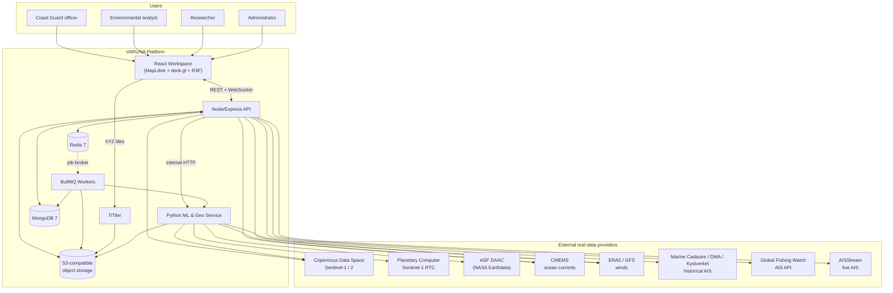
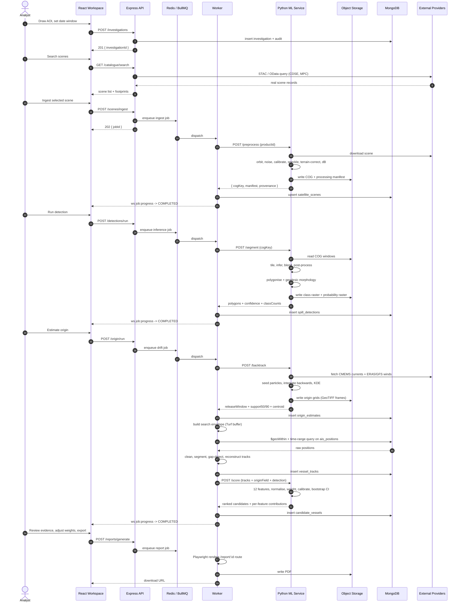
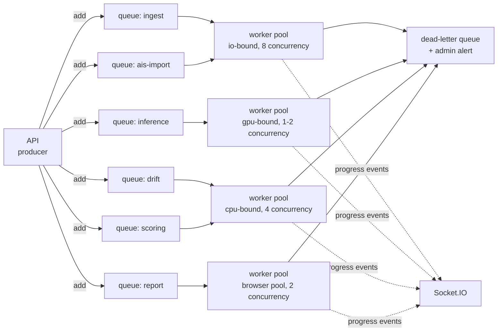
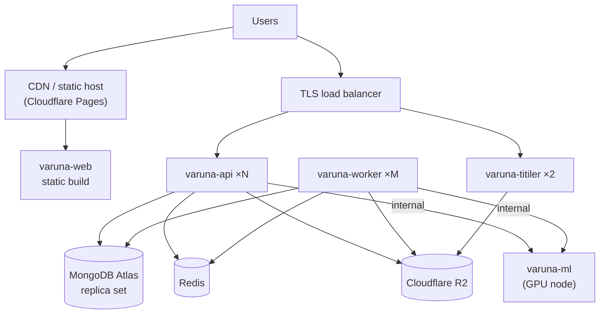
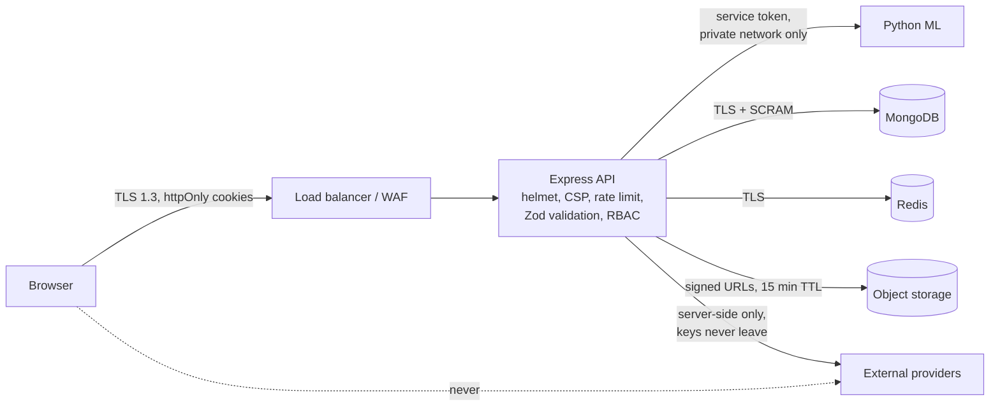

# 03 — System Architecture

**Product:** VARUNA
**Problem Statement:** SIH26143
**Document version:** 1.0

---

## 3.1 Architectural principles

| # | Principle | Consequence in the design |
|---|---|---|
| 1 | **Right language for the domain** | Geospatial raster work and deep learning stay in Python. Business logic, orchestration and the API stay in Node. We do not force GDAL into Node, and we do not force auth/RBAC into Python. |
| 2 | **Nothing slow in a request** | Anything over ~10 s becomes a queued job with an ID, a progress stream, and a cancel path. |
| 3 | **Coarse filter in the database, exact geometry in code** | MongoDB reduces millions of AIS rows to hundreds; Turf/Shapely then compute exact geodesy and write the result back as indexed GeoJSON. |
| 4 | **Every artefact is addressable and reproducible** | Scenes, masks, probability rasters, origin grids and PDFs live in object storage under content-addressed keys; every derived document records the manifest that produced it. |
| 5 | **Provenance is structural, not documentation** | It is a required field, validated at the model layer, enforced at the serialiser, and rendered by the UI. It cannot be skipped. |
| 6 | **Degrade loudly** | Every module has an `UNAVAILABLE` / `DEGRADED` state that propagates to the UI and the PDF. No silent defaults. |
| 7 | **Stateless services, stateful stores** | API and worker containers hold no local state; scale horizontally. |

---

## 3.2 System context



---

## 3.3 Service topology

| Service | Container | Language | Scaling | Public |
|---|---|---|---|---|
| `varuna-web` | nginx serving static Vite build | — | CDN | Yes |
| `varuna-api` | Node 20 / Express 5 | TypeScript | Horizontal, stateless, N replicas | Yes (TLS) |
| `varuna-worker` | Node 20 / BullMQ consumer | TypeScript | Horizontal by queue depth | No |
| `varuna-ml` | Python 3.11 / FastAPI + Uvicorn | Python | Vertical (GPU) + horizontal for CPU tasks | No |
| `varuna-titiler` | TiTiler (Python) | Python | Horizontal, cache-fronted | Yes (signed) |
| `mongodb` | MongoDB 7 / Atlas | — | Managed replica set, shardable | No |
| `redis` | Redis 7 / Upstash | — | Managed | No |
| `minio` (dev only) | MinIO | — | Single node | Local |

### 3.3.1 Why the ML service is separate rather than embedded

1. **Dependency isolation.** GDAL, PyTorch, SNAP and OpenDrift are heavy, native, and
   version-sensitive. Coupling them to the API container would make every API deploy a
   500 MB+ rebuild.
2. **Independent scaling.** Inference needs a GPU; the API does not. They scale on
   different axes and different cost curves.
3. **Failure isolation.** A CUDA OOM or a GDAL segfault must not take down authentication.
4. **Language fit.** There is no credible Node equivalent of rasterio, Shapely or
   OpenDrift. Reimplementing them would be the single largest source of correctness bugs
   in the project.

This is still MERN: MongoDB, Express, React and Node own the product. Python is a
specialised compute sidecar behind an internal HTTP boundary, in the same way a MERN app
would call an image-processing service.

---

## 3.4 Data flow — end to end



---

## 3.5 Component architecture

### 3.5.1 Express API internal layering

```
apps/api/src/
├── index.ts                  # bootstrap, graceful shutdown
├── env.ts                    # Zod-validated environment, fails fast
├── app.ts                    # express app, middleware chain
├── middleware/
│   ├── requestId.ts  auth.ts  rbac.ts  rateLimit.ts
│   ├── validate.ts           # Zod boundary validation
│   ├── errorHandler.ts       # RFC 9457 problem+json
│   └── provenanceGuard.ts    # strips + logs objects lacking provenance
├── modules/                  # one folder per bounded context
│   ├── auth/        { router, controller, service, model, schema }
│   ├── investigations/
│   ├── catalogue/
│   ├── scenes/
│   ├── detections/
│   ├── origin/
│   ├── ais/
│   ├── candidates/
│   ├── reports/
│   ├── jobs/
│   └── admin/
├── providers/                # one client per external data source
│   ├── ProviderClient.ts     # retry, backoff, circuit breaker, quota
│   ├── cdse.ts  planetaryComputer.ts  asf.ts
│   ├── cmems.ts  era5.ts  gfs.ts
│   └── ais/{marineCadastre,dmaDk,kystverket,gfw,aisStream}.ts
├── geo/                      # Turf wrappers with branded units
│   ├── units.ts  envelope.ts  trackGeometry.ts  knownAnswers.test.ts
├── queue/                    # BullMQ definitions + producers
├── realtime/                 # Socket.IO namespaces, rooms, auth
└── lib/                      # s3, mongo, redis, logger, mlClient
```

**Module contract:** every module exposes exactly `router.ts` (HTTP), `service.ts`
(business logic, no Express types), `model.ts` (Mongoose), and `schema.ts` (Zod, re-exported
from `packages/shared`). Controllers never touch Mongoose directly; services never touch
`req`/`res`.

### 3.5.2 Python ML service internals

```
services/ml/
├── main.py                   # FastAPI app, service-token auth
├── config.py                 # pydantic-settings
├── routers/
│   ├── preprocess.py         # SAR chain / RTC passthrough
│   ├── segment.py            # tiled inference
│   ├── vectorise.py          # mask -> polygons + morphology
│   ├── backtrack.py          # OpenDrift backward run
│   ├── score.py              # feature extraction + attribution model
│   └── health.py
├── sar/
│   ├── snap_graphs/*.xml     # SNAP gpt graph definitions
│   ├── preprocess.py  cog.py  landmask.py
├── models/
│   ├── architectures.py      # smp U-Net / U-Net++ / DeepLabV3+ / SegFormer
│   ├── inference.py          # tiling, cosine blending, AMP
│   ├── postprocess.py        # morphology, min-area, hole fill
│   └── registry.py           # content-addressed artefact loading
├── geo/
│   ├── polygonise.py  morphology.py  geodesy.py  projections.py
├── drift/
│   ├── forcing.py            # CMEMS + ERA5/GFS -> xarray
│   ├── backtrack.py          # OpenDrift wrapper
│   └── kde.py                # particle cloud -> probability surface
├── attribution/
│   ├── features.py           # the 12 evidence features
│   ├── model.py              # additive/logistic model + calibration
│   └── bootstrap.py          # confidence intervals
└── provenance.py             # every response carries provenance
```

### 3.5.3 React client structure

Full detail in [05_FRONTEND_Specification.md](05_FRONTEND_Specification.md). Topology:

```
apps/web/src/
├── app/            # router, providers, error boundaries
├── features/       # investigation, catalogue, detection, origin, ais,
│                   # candidates, evidence, reports, admin
├── map/            # MapLibre instance, deck.gl overlay, layer registry
├── three/          # R3F globe, slick relief, hero scene
├── design/         # tokens, primitives, motion presets
├── state/          # zustand stores: map, time, layers, selection, ui
├── api/            # typed client generated from OpenAPI + TanStack Query hooks
└── lib/            # units, formatters, geo helpers, provenance guard
```

---

## 3.6 Job queue architecture



| Queue | Typical duration | Retries | Backoff | Concurrency |
|---|---|---|---|---|
| `ingest` | 2–15 min | 3 | exp, 30 s base | 8 |
| `inference` | 1–4 min (GPU) | 2 | exp, 60 s base | 1–2 per GPU |
| `drift` | 30–90 s | 3 | exp, 20 s base | 4 |
| `ais-import` | 1–20 min | 3 | exp, 30 s base | 8 |
| `scoring` | 1–3 s | 3 | exp, 5 s base | 8 |
| `report` | 10–25 s | 2 | exp, 15 s base | 2 |

**Job lifecycle:** `QUEUED → RUNNING → (COMPLETED | FAILED | CANCELLED)`. A `jobs`
document mirrors BullMQ state so the UI can query history after the Redis job is evicted.
Progress is emitted as `{ jobId, pct, stage, message }` on the investigation's Socket.IO
room.

**Idempotency:** each job carries a deterministic `jobKey` (e.g.
`ingest:${productId}`) used as the BullMQ job ID, so a duplicate enqueue is a no-op rather
than a second 1 GB download.

---

## 3.7 Storage architecture

### 3.7.1 Object storage layout

```
s3://varuna/
├── scenes/{productId}/
│   ├── raw/{originalFilename}
│   ├── cog/{polarisation}.tif           # analysis-ready, COG
│   ├── quicklook.png
│   └── manifest.json                    # processing manifest + provenance
├── detections/{detectionId}/
│   ├── classmap.tif                     # argmax class raster (COG)
│   ├── probability.tif                  # per-class probability stack (COG)
│   └── polygons.geojson
├── origin/{originEstimateId}/
│   ├── frames/{isoTimestamp}.tif        # KDE probability surface per step
│   ├── particles.parquet                # full ensemble trajectories
│   └── forcing_manifest.json
├── ais/archive/{source}/{yyyy-mm}/*.parquet
├── models/{sha256}/model.pt             # content-addressed artefacts
└── reports/{reportId}/dossier.pdf
```

**Rule:** the database stores *keys and metadata*, never blobs. Nothing in MongoDB exceeds
the 16 MB document limit, and large geometries are simplified per zoom level at read time.

### 3.7.2 Why Cloud-Optimised GeoTIFF

A Sentinel-1 IW GRD scene is roughly 1 GB. COG with internal tiling and overviews allows:
- **Windowed reads** — inference reads only the tiles it needs via HTTP range requests.
- **Direct tile serving** — TiTiler renders XYZ map tiles from the COG on the fly, so the
  map shows the *real raster*, never a screenshot or a pre-baked image.
- **No full download for display** — the browser never pulls the gigabyte.

---

## 3.8 Realtime architecture

| Namespace | Room | Events | Auth |
|---|---|---|---|
| `/jobs` | `job:{jobId}` | `job:progress`, `job:completed`, `job:failed` | JWT from cookie, verified in the Socket.IO handshake |
| `/investigations` | `inv:{investigationId}` | `investigation:update`, `detection:new`, `candidate:reranked`, `comment:new`, `presence:*` | JWT + membership check |
| `/ais` | `ais:{aoiHash}` | `ais:tick` (batched position updates) | JWT + role ≥ analyst |

The live AIS bridge is a dedicated worker holding one upstream AISStream WebSocket,
filtering by subscribed bounding boxes, batching at 1 Hz, and fanning out to rooms. The
browser never connects to the upstream provider — that would leak the API key.

---

## 3.9 Local development architecture

```yaml
# docker-compose.yml (abridged)
services:
  mongo:       # mongo:7, replica-set enabled (needed for transactions)
  redis:       # redis:7-alpine
  minio:       # object storage + console
  createbuckets: # one-shot: mc mb varuna
  titiler:     # ghcr.io/developmentseed/titiler
  ml:          # build ./services/ml, mounts ./data/models
  api:         # build ./apps/api, depends_on mongo/redis/minio/ml
  worker:      # same image as api, different command
  web:         # vite dev server, proxies /api and /ws
```

`docker compose up` must produce a fully working system on a clean machine using only the
variables in `.env.example`. This is a release criterion (PRD §12.7).

**Demo data pre-staging:** a documented `pnpm run stage:demo` script downloads the *real*
demo-incident scene and the *real* AIS archive slice once, into MinIO and MongoDB, so a
live demo never depends on provider uptime or quota. This is caching real data, not
fabricating it — the provenance records are the originals.

---

## 3.10 Deployment architecture



| Environment | Purpose | Notes |
|---|---|---|
| `local` | Development | docker compose, MinIO, local Mongo |
| `staging` | Integration + demo rehearsal | Same topology, smaller instances, real providers |
| `production` | Deployment target | Managed Mongo/Redis, R2, GPU node for ML |

**CI/CD (GitHub Actions):**
`lint → typecheck → unit tests → geodesy known-answer tests → real-data policy check → secret scan → build images → integration tests (Testcontainers) → E2E (Playwright) → deploy`.
Model changes additionally run the evaluation gate: the build fails if oil-class IoU drops
below the committed threshold on the held-out real test split.

---

## 3.11 Scaling strategy

| Pressure | Symptom | Response |
|---|---|---|
| More concurrent users | API p95 rises | Add `varuna-api` replicas (stateless) |
| More scenes to process | `inference` queue depth grows | Add GPU workers; batch overnight; use MPC RTC to skip preprocessing |
| More AIS volume | Envelope queries slow | Shard `ais_positions` on `{meta.mmsi hashed, t}`; archive >24 months to Parquet |
| Large slick polygons | Payload size | Server-side simplification by zoom; vector tiles for detections |
| Many map viewers | Tile server load | Cache tiles at the CDN keyed by `{sceneId,z,x,y,rescale}`; TiTiler replicas |
| Provider rate limits | 429s | Circuit breaker + provider fallback chain + request coalescing in Redis |

---

## 3.12 Failure modes and behaviour

| Failure | Detection | Behaviour | User-visible result |
|---|---|---|---|
| Satellite provider down | Circuit breaker opens after 5 consecutive failures | Fall back to next provider in chain (CDSE → MPC → ASF) | Banner: "Primary catalogue unavailable, using Planetary Computer" |
| All satellite providers down | Chain exhausted | Return `UNAVAILABLE` | "Scene catalogue unavailable. Cached scenes remain usable." No fake results. |
| CMEMS/ERA5 unavailable for date | Fetch returns empty/404 | Origin estimate `status: DEGRADED`, `method: FOOTPRINT_PROXIMITY` | Explicit banner + the PDF states the degradation and its effect on confidence |
| No AIS coverage for region | Zero rows returned | Candidate list empty with `reason: NO_AIS_COVERAGE` | "No AIS records for this envelope from the configured sources." Never an empty-looking success. |
| GPU OOM during inference | Exception in ML service | Retry at reduced batch size, then CPU fallback | Progress message: "Retrying at lower batch size" |
| ML service unreachable | Health check + timeout | Job fails with retry; API stays up | Job card shows FAILED with reason and a retry button |
| Mongo primary failover | Driver reconnect | Retryable writes; job retried | Transient slowdown only |
| Redis loss | Connection error | Jobs in flight recovered from the `jobs` collection on restart; new jobs rejected with 503 | "Processing temporarily unavailable" |
| Quota exhausted on a provider key | Quota counter in Redis | Fall through the chain; admin alert | Admin sees the exhausted key; analyst sees the fallback banner |
| Corrupt / non-georeferenced upload | GDAL open fails or transform missing | Reject at ingest | "This file has no georeferencing or acquisition time and cannot be used." |

**The invariant across every row:** no failure path produces a plausible-looking wrong
number. Every one produces an explicit, labelled absence.

---

## 3.13 Security architecture



Trust boundaries: the browser is untrusted; the API is the only public trust anchor; the
ML service and datastores are private; provider credentials exist only in the API/worker
process environment.

---

## 3.14 Architecture Decision Records (condensed)

| ADR | Decision | Alternatives rejected | Reason |
|---|---|---|---|
| ADR-001 | MongoDB as primary store, with a Turf/Shapely compute layer | PostGIS | MERN mandate; compensated explicitly rather than silently (TRD §2.6) |
| ADR-002 | Separate Python ML/geo service | Node-only with ONNX + JS geometry | rasterio/Shapely/OpenDrift have no Node equivalent; reimplementation would be the top bug source |
| ADR-003 | MapLibre GL + deck.gl | Leaflet, plain Mapbox | Leaflet cannot render 10^5+ animated points; MapLibre avoids a mandatory token |
| ADR-004 | BullMQ over Redis | Agenda (Mongo-backed), in-process | Mature retries/backoff/DLQ/progress; Redis already needed for cache |
| ADR-005 | Time-series collection for AIS | Standard collection | Order-of-magnitude storage and scan improvement at 10^8+ documents |
| ADR-006 | COG + TiTiler for imagery | Pre-rendered PNG tiles | Serves the real raster; supports windowed inference; no duplicate storage |
| ADR-007 | Additive transparent scoring model | Gradient boosting / neural ranker | Explainability is a product requirement, not a nice-to-have; labels are too scarce to justify a complex model |
| ADR-008 | Lagrangian back-tracking for origin | Assume slick centroid = release point | Centroid assumption is a documented cause of false attribution |
| ADR-009 | Provenance as a required schema field | Provenance as documentation | Only a structural constraint can guarantee the no-fake-data policy |
| ADR-010 | Playwright-rendered PDF | PDFKit / LaTeX | Report typography must match the app exactly; the report route is already built |
| ADR-011 | Vite SPA, not Next.js | Next.js | No SEO or SSR benefit behind auth; SPA keeps the WebGL workstation simple |
| ADR-012 | Zod schemas shared client/server | Separate DTOs | One source of truth eliminates contract drift |
