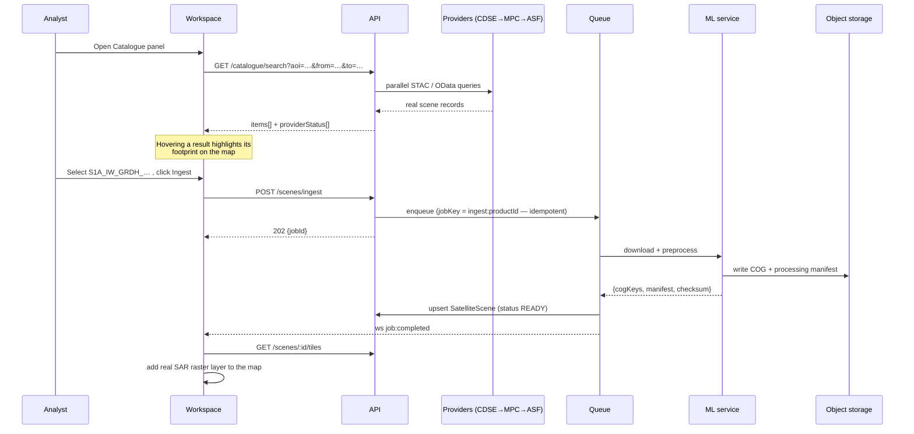
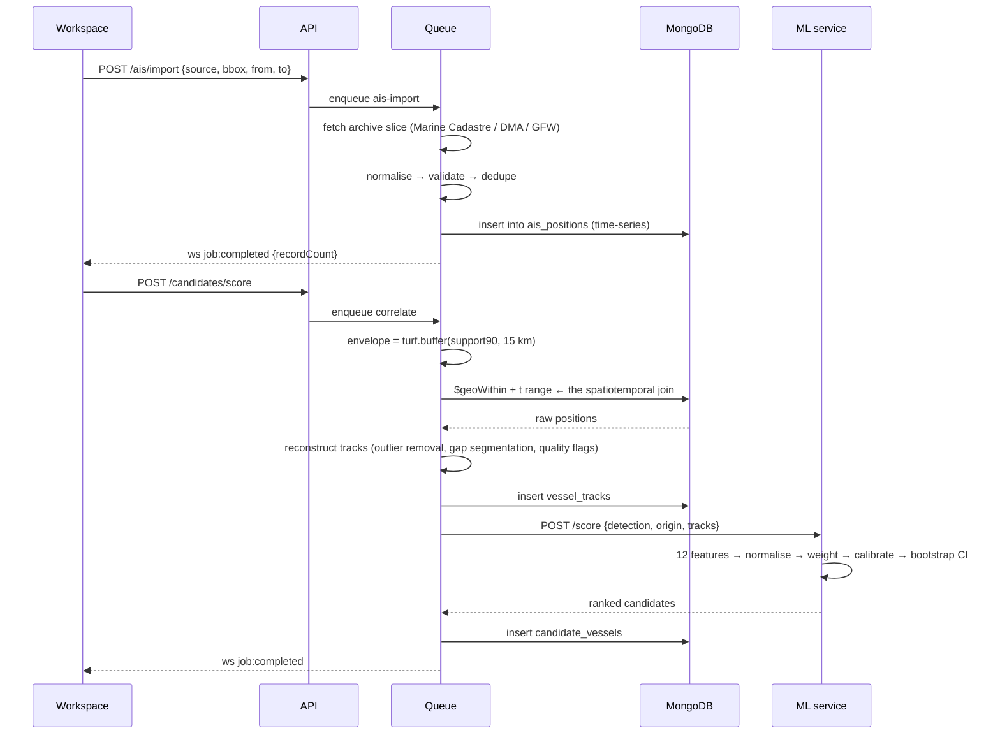
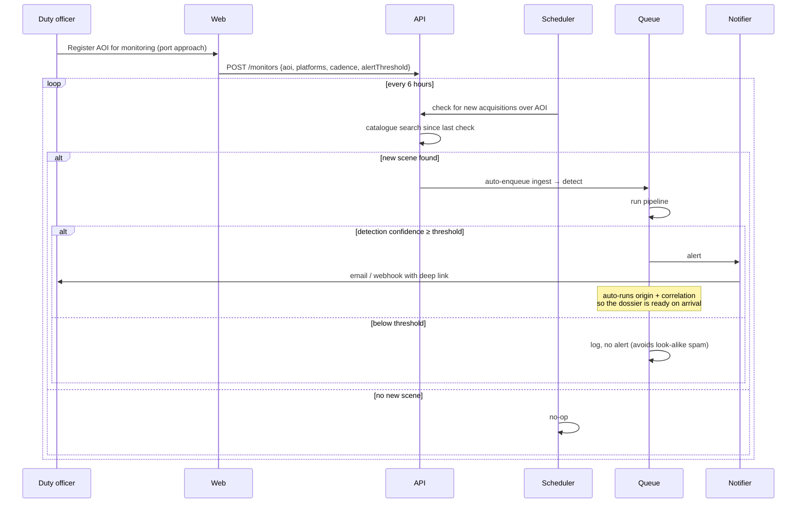
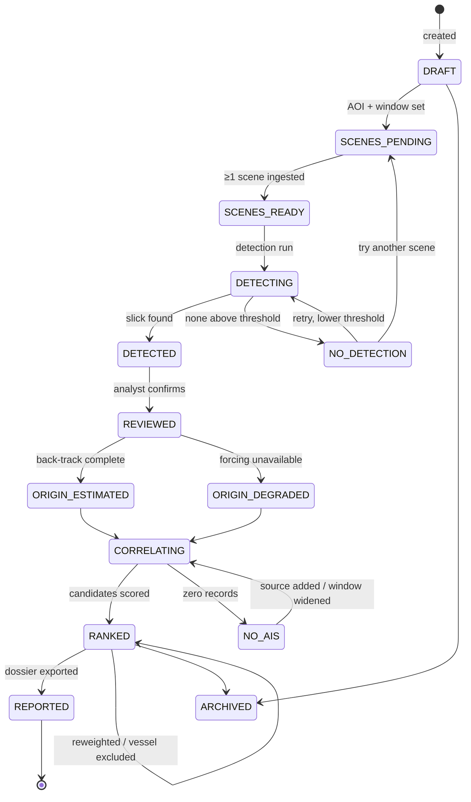
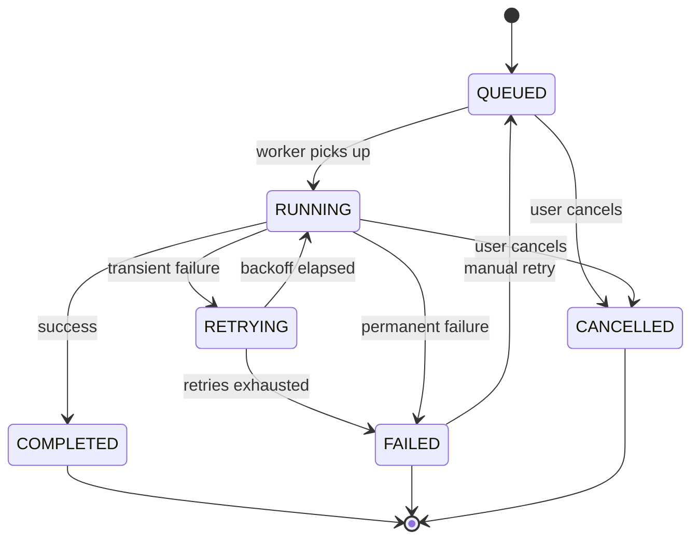
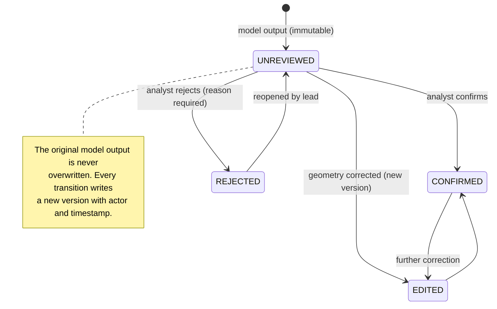
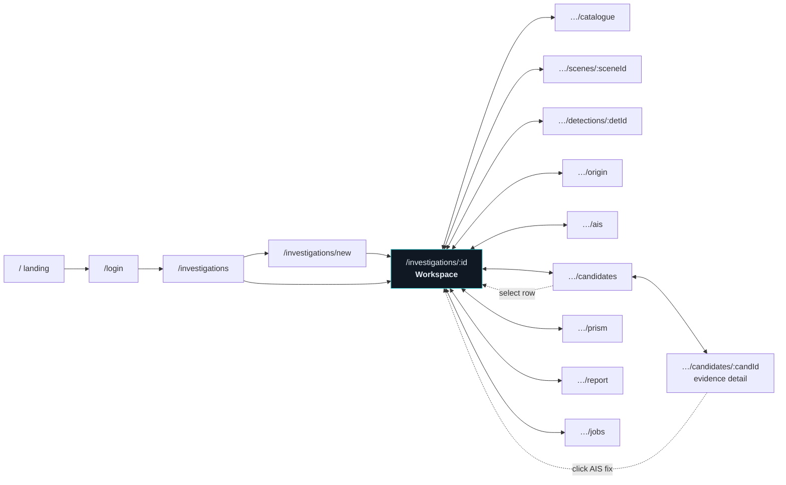

# 08 — Application Flow

**Product:** VARUNA
**Document version:** 1.0

> This document traces what actually happens, screen by screen and call by call, from a
> user opening the app to exporting a defensible dossier. It is the reference for demo
> rehearsal and for anyone who needs to understand the system without reading code.

---

## 8.1 The pipeline in one picture

```mermaid
flowchart TD
    A["1 · Define incident<br/><small>AOI + UTC time window</small>"] --> B["2 · Search catalogue<br/><small>live STAC query</small>"]
    B --> C["3 · Ingest scene<br/><small>download + SAR preprocessing → COG</small>"]
    C --> D["4 · Detect slick<br/><small>5-class segmentation</small>"]
    D --> E["5 · Vectorise<br/><small>polygons + geodesic area + morphology</small>"]
    E --> F["6 · Human review<br/><small>confirm / reject / edit</small>"]
    F --> G["7 · Back-track drift<br/><small>real currents + winds → origin field</small>"]
    G --> H["8 · Estimate release window<br/><small>interval, not instant</small>"]
    H --> I["9 · Build search envelope<br/><small>Turf buffer of 90% support</small>"]
    I --> J["10 · Query AIS<br/><small>$geoWithin + time range</small>"]
    J --> K["11 · Reconstruct tracks<br/><small>clean, gap-segment, quality flag</small>"]
    K --> L["12 · Extract 12 features<br/><small>per candidate vessel</small>"]
    L --> M["13 · Score &amp; rank<br/><small>additive model + calibration + CI</small>"]
    M --> N["14 · Review evidence<br/><small>waterfall, drill-down, reweight</small>"]
    N --> O["15 · Export dossier<br/><small>PDF + GeoJSON + CSV + manifest</small>"]

    D -.->|"no slick found"| Z1["Report: no detection<br/>with scene metadata"]
    G -.->|"forcing unavailable"| Z2["DEGRADED:<br/>footprint proximity mode"]
    J -.->|"no records"| Z3["NO_AIS_COVERAGE<br/>sources queried listed"]
    M -.->|"&lt; 6 measured features"| Z4["INSUFFICIENT_EVIDENCE"]

    style Z1 fill:#1F2C3C,stroke:#6B7F94
    style Z2 fill:#1F2C3C,stroke:#F5B944
    style Z3 fill:#1F2C3C,stroke:#F5B944
    style Z4 fill:#1F2C3C,stroke:#F2564B
```

The four dotted branches are as important as the main path. Each is a legitimate,
fully-designed outcome — not an error state to be engineered away.

---

## 8.2 Journey 1 — First-time user, complete investigation

This is the demo path and the primary user journey.

### Step 0 · Sign in
`/login` → email + password → argon2id verify → access + refresh cookies set → redirect to
`/investigations`.

### Step 1 · Create the investigation

| Sub-step | Screen | What happens |
|---|---|---|
| 1.1 | `/investigations/new` step 1 | Name, description, optional incident reference |
| 1.2 | step 2 | Draw the AOI on the map. Live geodesic area readout in km². Over 50,000 km² blocks with the actual figure shown. |
| 1.3 | step 3 | UTC start/end. Duration shown. Optional "reported incident time" seeds the release-window prior. |
| 1.4 | step 4 | **Live catalogue preview** runs before creation: *"14 Sentinel-1 acquisitions intersect this AOI in this window."* If zero, the user is told to widen the window rather than creating a dead investigation. |
| 1.5 | — | `POST /investigations` → 201 → redirect to `/investigations/:id` |

### Step 2 · Find and ingest a scene

The analyst now sees the **actual satellite raster**, served tile-by-tile from the COG.
Not a screenshot, not a preview image.

### Step 3 · Run detection

1. Scenes panel → `Run detection`.
2. `POST /detections/run` → 202. Progress streams: `TILING` → `INFERENCE` → `BLENDING` →
   `POSTPROCESS` → `VECTORISE`.
3. On completion the map gains the slick polygon layer, hatched because
   `reviewStatus = UNREVIEWED`.
4. Detections panel lists each polygon with geodesic area, confidence, and morphology.

### Step 4 · Review the detection

Analyst opens `/investigations/:id/detections/:detId`:

- **Confidence panel** shows all four terms separately: model probability, look-alike
  separation, wind suitability (from the *real* ERA5 wind at acquisition time), and shape.
- **Probability overlay** slider reveals where the model was uncertain.
- **Comparator** shows the previous acquisition over the same footprint — often the single
  most convincing artefact, because the sea was clean 6 days earlier.
- Analyst clicks `Confirm`. A new version is written; the model's original output is
  preserved immutably.

### Step 5 · Back-track to origin

1. Origin panel → `Estimate origin`. Parameters: horizon (default 24 h), particle count
   (default 5,000).
2. `POST /origin/run` → 202. Progress: `FETCH_CURRENTS` → `FETCH_WINDS` → `SEEDING` →
   `INTEGRATING` → `KDE` → `CONTOURING`.
3. The map gains: the origin probability surface (violet ramp), the 50% and 90% contours,
   and the drift particle cloud.
4. The timeline gains the **release window band** — an interval with a darker "most likely"
   sub-band.
5. The Origin panel names the forcing sources explicitly: *"Currents: CMEMS
   GLOBAL_ANALYSISFORECAST_PHY_001_024, retrieved 2026-08-27. Winds: ERA5 10 m, retrieved
   2026-08-27."* with provenance chips on both.

**If forcing data is missing**, the panel instead shows a persistent amber
`DegradationBanner`: *"Ocean current data unavailable for this date and region. Origin
estimated by footprint proximity (40 km buffer). Confidence in all downstream scores is
reduced accordingly."* The run continues — it does not silently invent a current field.

### Step 6 · Import and correlate AIS

The AIS panel shows a coverage summary first — source, record count, first/last timestamp,
median sampling interval — so the analyst knows what evidence base they are working from
before seeing any ranking.

### Step 7 · Work the evidence

The candidate list appears, ranked. Typical analyst sequence:

1. Hover row 1 → its track lights up, all others fade to 25%.
2. Click row 1 → evidence waterfall expands; camera flies to fit the track and the origin
   support.
3. Press `Space` → timeline plays. The vessel is watched transiting the origin zone during
   the release window. The dashed segment where AIS went dark is visible.
4. Click the `ais_dark_period` row → the source records drawer opens showing the last fix
   before silence and the first after, with exact UTC timestamps.
5. Open the Prism view → the space-time cube shows the track's helix passing through the
   bright origin slice. A competing candidate's helix passes through the same *place* but
   at a *different height* — visibly wrong in time. This is the moment the correlation
   becomes intuitive.
6. Open `Weights ▾` → drop `vessel_type_prior` to zero to test whether the ranking is
   driven by a prior rather than by evidence. The list re-ranks with FLIP animation. Row 1
   holds position. The analyst notes this in a comment.

### Step 8 · Export

1. Report panel → select sections. `Uncertainty & Limitations` and `Data Provenance` cannot
   be deselected — the UI shows them locked with an explanation.
2. `Generate PDF` → 202 → Playwright renders the real report route → PDF in object storage
   → download link.
3. Additional exports: GeoJSON bundle, candidates CSV, run manifest JSON.

**Total elapsed for the demo incident: about 12 minutes**, most of it scene ingestion.

---

## 8.3 Journey 2 — The honest null result

Equally important to demonstrate: the system correctly declining to conclude.

```mermaid
flowchart TD
    A["Analyst runs the full pipeline"] --> B{"Slick detected?"}
    B -->|No| N1["Detections panel:<br/>'No oil-class regions above threshold.'<br/>Shows scene metadata, wind at acquisition,<br/>and the threshold used.<br/>Offers: lower threshold, try another scene."]
    B -->|Yes| C{"Forcing data available?"}
    C -->|No| D["DEGRADED mode<br/>banner + wider envelope"]
    C -->|Yes| E["Origin field computed"]
    D --> F
    E --> F{"AIS records in envelope?"}
    F -->|"Zero"| N2["'No AIS records for this envelope.'<br/>Lists every source queried and its coverage.<br/>Suggests: widen window, add a source,<br/>check whether the region has coverage at all."]
    F -->|Yes| G["Tracks reconstructed"]
    G --> H{"≥ 6 features measurable<br/>for any vessel?"}
    H -->|No| N3["INSUFFICIENT_EVIDENCE panel<br/>above the list.<br/>Shows WHICH features could not be measured<br/>and why."]
    H -->|Yes| I["Ranked candidates"]
    I --> J{"Top score ≥ 30?"}
    J -->|No| N3
    J -->|Yes| K["Ranking presented with tier + CI"]

    style N1 fill:#1F2C3C,stroke:#6B7F94
    style N2 fill:#1F2C3C,stroke:#F5B944
    style N3 fill:#1F2C3C,stroke:#F2564B
```

Every null branch tells the analyst three things: **what was found, what was queried, and
what to try next.** None of them shows an empty panel.

---

## 8.4 Journey 3 — Standing area monitoring (Phase 2)

---

## 8.5 State machines

### 8.5.1 Investigation

### 8.5.2 Job

### 8.5.3 Detection review

---

## 8.6 Screen-to-screen navigation

The map never unmounts across any of these transitions — the panels change around a
persistent map instance.

---

## 8.7 Error and recovery flows

| Trigger | What the user sees | Recovery |
|---|---|---|
| Session expires mid-work | Silent refresh attempt; if it fails, a modal appears preserving the current URL | Re-login returns to the exact screen |
| Ingest job fails (provider 5xx) | Job card turns red with the verbatim provider error | `Retry` button; or pick another provider from the catalogue result |
| GPU OOM during inference | Progress message: *"Retrying at reduced batch size"* | Automatic; falls back to CPU if it fails again |
| Forcing data missing | Amber `DegradationBanner`, non-dismissible | Analyst may proceed in degraded mode or choose a different date |
| Zero AIS records | Panel lists every source queried with its coverage window | Add a source, widen the window, or accept the null result |
| WebSocket disconnects | `stale` banner on affected panels | Auto-reconnect with backoff; rooms re-joined; queries refetched |
| WebGL context lost | Map re-initialises from stores | Layer state and camera restored automatically |
| Provenance missing on an object | Red `PROVENANCE MISSING` block replaces the data | Severity-1 alert to operators; the analyst is told not to rely on that object |
| Report render times out | Job fails with the failing section named | Retry, or deselect an optional section |

---

## 8.8 Keyboard flow

| Key | Action | Available in |
|---|---|---|
| `⌘K` / `Ctrl+K` | Command palette — jump to any investigation, vessel or action | Everywhere |
| `⌘\` | Toggle evidence panel | Workspace |
| `Space` | Play / pause timeline | Workspace |
| `←` `→` | Step to previous / next real AIS fix | Workspace |
| `⇧←` `⇧→` | Step by one hour | Workspace |
| `1`–`9` | Toggle layer *n* | Workspace |
| `M` | Enter map keyboard mode | Workspace |
| `F` | Fit view to the selected feature | Workspace |
| `P` | Toggle 3D prism | Workspace |
| `R` | Toggle slick relief (3D terrain) | Workspace |
| `E` | Open evidence detail for the selected candidate | Candidates |
| `X` | Exclude selected candidate (opens reason dialog) | Candidates |
| `?` | Shortcut reference | Everywhere |
| `Esc` | Close topmost overlay / exit map keyboard mode | Everywhere |

---

## 8.9 Demo script (12 minutes)

For SIH presentation. Every step uses real, pre-staged data with visible provenance.

| Time | Action | The point being made |
|---|---|---|
| 0:00 | Landing page: the globe rotates to the incident location | Orientation; this is a real place and a real date |
| 0:45 | Open the pre-created investigation | Skip setup, go to substance |
| 1:15 | Catalogue panel: show the live query returning real Sentinel-1 products with real product IDs | *The data is real and verifiable — here is the product identifier* |
| 2:00 | SAR raster layer on the map; zoom into the dark patch | The physical signature: oil damps waves, backscatter drops |
| 2:45 | Run detection live; watch the progress stages | The pipeline is real, not pre-rendered |
| 3:30 | Slick polygon appears with geodesic area in km² | Correct measurement, not degrees |
| 4:00 | Confidence panel: four separate terms including **real wind speed at acquisition** | We know the physical limits of our own sensor |
| 4:45 | Before/after comparator: same footprint, six days earlier, clean sea | The most persuasive single artefact |
| 5:30 | Run back-track; particle cloud animates backwards | **The core differentiator** — the slick is not where it started |
| 6:30 | Release window band appears on the timeline | Time is an interval, not an instant |
| 7:00 | AIS import: show the coverage summary (source, record count, interval) | We show our evidence base before showing conclusions |
| 7:45 | Candidates appear, ranked with tiers and CIs | Explainable ranking, not a verdict |
| 8:15 | Expand the evidence waterfall; point at the `NOT MEASURED` rows | *We render what we could not measure* |
| 9:00 | Click a feature → drill down to actual AIS fixes with UTC timestamps | Every number traces to a source record |
| 9:45 | Play the timeline; the top candidate transits the origin zone during the window and goes dark | The story becomes visible |
| 10:30 | Open the Prism: the helix passes through the bright origin slice; a competitor's does not | Space and time are both constraints |
| 11:00 | Zero out `vessel_type_prior`; ranking holds | The result is evidence-driven, not prior-driven |
| 11:30 | Export the PDF; open to the Uncertainty and Provenance appendices | Defensibility is the deliverable |
| 12:00 | Close on the honesty statement | We rank for investigation; we never assert guilt |

**Judge-question contingency:** if asked "is this real?", open the provenance inspector on
any object on screen. It shows the provider, dataset ID, exact external product identifier,
retrieval timestamp, licence, and checksum. Offer to run the catalogue search live against
a date the judges choose.
