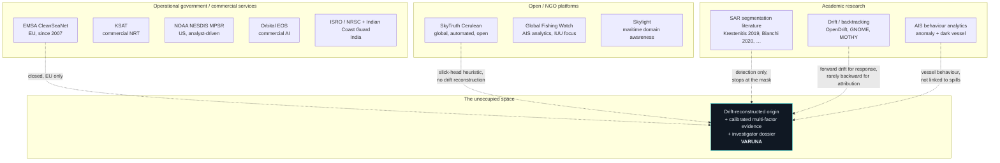

# 09 — Research & Competitive Analysis

**Product:** VARUNA
**Problem Statement:** SIH26143
**Document version:** 1.0

> This document surveys what already exists, states honestly what those systems do well,
> identifies the specific gaps VARUNA addresses, and defines the differentiation we can
> actually defend. Where we cannot beat an existing system, this document says so.

---

## 9.1 Why an honest competitive analysis matters here

Oil-spill detection from SAR is a **mature field**. It has been operational in Europe since
2007. Claiming novelty for "detecting oil spills with AI" would be false and any informed
judge would know it. Our contribution has to be located precisely, and it is:

> Existing systems are **monitoring services** that answer *"is there a slick, and which
> vessel is nearest to it?"* VARUNA is an **investigation workstation** that answers
> *"where and when was this released, which vessels could have been there, how strong is
> the evidence for each, and can I defend that in a report?"*

The difference is the **origin reconstruction layer** and the **evidence dossier**. Those
are the two things this document must justify.

---

## 9.2 Landscape map

---

## 9.3 Detailed system-by-system analysis

### 9.3.1 EMSA CleanSeaNet — the operational benchmark

| Aspect | Detail |
|---|---|
| **Operator** | European Maritime Safety Agency |
| **Since** | April 2007 |
| **Sensor** | Primarily SAR, supplemented by optical |
| **Scale** | More than 3,000 satellite images delivered to end users per year |
| **AIS source** | SafeSeaNet — AIS positions from terrestrial receiving antennas along European coastlines |
| **Method** | **Trained human operators** assess each image alongside meteorological, oceanographic and ancillary information (including AIS and vessel detection) to judge the likelihood of oil and assist in identifying the source |
| **Output** | Near-real-time alert report to national contact points, who action the response |
| **Legal weight** | CleanSeaNet imagery has been used as primary evidence in court — the Maersk Kiera case in the UK (February 2012) is a documented example |

**What it does better than we ever will:** guaranteed satellite coverage of EU waters,
institutional integration with national response chains, an operator corps with two decades
of accumulated interpretation expertise, and legal standing.

**The genuine gaps:**

1. **It is closed.** Access is restricted to EU member-state authorities. The vast majority
   of the world's coastline — including all of India's — has no equivalent.
2. **Attribution is expert judgement, not a reproducible computation.** An operator
   "assists in identifying the source." That expertise is real, but it is not
   parameterised, not calibrated, not auditable feature-by-feature, and does not scale.
3. **Human-in-the-loop throughput is the ceiling.** Roughly 3,000 images per year is a
   fraction of what Sentinel-1 acquires globally.
4. **No published per-candidate evidence decomposition.** The reasoning is in the
   operator's head and their report prose, not in a structured, queryable evidence object.

**Our position relative to it:** we are not competing on coverage or institutional
authority. We are producing the reproducible, auditable, open version of the reasoning
step — and making it available where CleanSeaNet is not.

---

### 9.3.2 SkyTruth Cerulean — the closest existing system

This is the system most similar to ours and the one we must differentiate from most
carefully. It is open, global, automated, and genuinely good.

| Aspect | Detail (from SkyTruth's published methodology) |
|---|---|
| **Detection model** | ResNet-34-based U-Net |
| **Input** | Sentinel-1 **VV polarisation only**, scaled to **80 m** resolution |
| **Tiling** | Overlapping 512 × 512 tiles; overlapping confidences merged by **averaging** |
| **Coverage** | Scans **all** Sentinel-1 data over ocean and inland seas, globally |
| **Latency** | Imagery reaches the model within 6–12 hours of overpass; scoring takes minutes |
| **AIS window** | **8 hours before to 6 hours after** the image acquisition |
| **AIS latency** | Their AIS source operates with a **72-hour delay** |
| **Attribution metrics** | **Three**: *Parity* (slick length vs. its projection along the AIS track — a parallelism measure), *Proximity* (distance from the **slick head** to the nearest point on the AIS track), *Temporality* (timestamp of AIS broadcasts spatially near the slick head) |
| **Other sources** | Probability that fixed infrastructure or **dark objects** (vessels 30 m+ not broadcasting AIS) are the source, based on proximity and directional alignment |
| **Confidence score** | Near-real-time score from **slick geometry** — size, compactness, elongation, multipart structure — estimating resemblance to confirmed vessel-related pollution |
| **Stated limitation** | "It is not possible to definitively identify oil slicks using SAR satellite data alone." All detections are *potential*, not definitive. |
| **Integration** | Cerulean detections are integrated into the Skylight maritime domain awareness platform |

**What Cerulean does better than us:** global continuous coverage, a mature production
pipeline, operational latency measured in hours, real-world adoption, and a validated-slick
human review programme. We are not going to out-scale them in a hackathon.

**The specific technical gaps — and these are the ones VARUNA is built around:**

| # | Gap in Cerulean | Why it matters | What VARUNA does |
|---|---|---|---|
| **1** | **Attribution anchors on the "slick head"** — the assumed upstream end of the observed slick. There is no physical drift reconstruction. | The slick head is a *proxy* for the release point, and it degrades as elapsed time grows. Over 12–24 hours of drift, the true release location can be tens of kilometres from the observed head, and the offset direction depends on the current and wind field, not on slick geometry. | Backward Lagrangian transport driven by **real CMEMS currents and real ERA5/GFS winds**, producing an **origin probability field** with 50%/90% support contours. See [07_AIML §7.3](07_AIML_Specification.md). |
| **2** | **No release-time estimation.** The AIS window is a fixed −8 h/+6 h around the image. | A fixed window treats all slicks identically, whether they were released 40 minutes or 20 hours before the overpass. Temporal evidence is therefore coarse. | A **release-time window** derived from slick major-axis length divided by modelled drift speed, bounded below by the last prior clear acquisition over the same footprint. Time becomes an estimated interval, and temporal alignment becomes a real discriminating feature (F2). |
| **3** | **Three geometric association metrics.** | Parity, proximity and temporality are all measures of *coincidence with the observed slick*. They do not include AIS integrity, speed plausibility, draught change, or manoeuvre anomaly. | **Twelve** evidence features across four independent families — spatial, temporal, kinematic, and behavioural/integrity — each individually inspectable, with the raw measured value shown next to its contribution. |
| **4** | **AIS gaps are handled as absence.** Dark *objects* are detected in imagery, but a broadcasting vessel that goes silent during the window is not, as published, treated as a distinct positive signal. | Transponder silence coincident with a probable release window and location is one of the most operationally meaningful behavioural signals in illegal discharge. | `ais_dark_period` (F5) is a **first-class positive evidence feature** with weight 0.10, showing duration, entry and exit fixes, and whether the dark period overlaps the origin zone. |
| **5** | **80 m working resolution, VV only.** | Downsampling from 10 m to 80 m is the right call for global-scale compute, but it costs boundary precision — and the boundary is what seeds the drift model and produces the morphology used as evidence. VV-only discards the cross-polarisation channel that helps separate oil from look-alikes. | **10 m native resolution**, 256² tiles, and **three channels** (VV, VH, VV−VH ratio). We can afford this because we process selected scenes for an investigation, not the whole planet continuously. This is a scope trade, not a claim of superiority. |
| **6** | **Confidence is slick-geometry resemblance.** | A geometric-resemblance score answers "does this look like known vessel pollution?" It does not incorporate whether the *sensing conditions* permitted a reliable detection at all. | Confidence combines model probability, look-alike class competition, **real wind speed at acquisition** against the physical 3–10 m/s detectability window, and morphology — reported as four separate terms, not one blended number. |
| **7** | **Overlapping tile confidences merged by averaging.** | Simple averaging gives an edge pixel — which the network saw with half the context — the same weight as a centre pixel, producing seam artefacts along tile boundaries. | **Cosine (Hann) window weighted blending**, so centre predictions dominate and overlaps blend smoothly. |
| **8** | **Monitoring feed, not a case file.** | Cerulean's output is a detection with an associated source — the right output for a monitoring service. It is not a dossier with methodology, uncertainty, provenance and drill-down. | A **PDF evidence dossier** with mandatory Uncertainty and Provenance sections, per-feature drill-down to individual AIS fixes, recorded weight profile, model hash, and a reproducible run manifest. |

**The honest summary:** Cerulean is a better *monitoring system* than VARUNA will be.
VARUNA is designed to be a better *investigation tool* than Cerulean, and the origin
reconstruction layer is the reason.

---

### 9.3.3 KSAT (Kongsberg Satellite Services)

| Aspect | Detail |
|---|---|
| Type | Commercial near-real-time maritime surveillance |
| Strength | Multi-mission satellite tasking, high-latitude ground stations giving very fast downlink, decades of operational service to governments and oil majors |
| Gap for us | Fully commercial, closed methodology, priced for institutional customers. No public evidence decomposition. |
| Our position | We do not compete. Different market, different capability class. |

### 9.3.4 NOAA NESDIS Marine Pollution Surveillance Reports

| Aspect | Detail |
|---|---|
| Type | US government analyst-generated reports from SAR and optical imagery |
| Strength | Authoritative, validated, publicly available — an excellent **ground-truth source for us** (see [10_DATASETS §10.5](10_DATASETS_and_Sources.md)) |
| Gap | Analyst-driven and slow; no automated vessel attribution component |
| Our position | Consumer, not competitor. We use MPSR records to validate our detections. |

### 9.3.5 Global Fishing Watch

| Aspect | Detail |
|---|---|
| Type | Open AIS analytics platform, NGO |
| Strength | The best open AIS infrastructure in existence: vessel identity, derived events (encounters, loitering, port visits, gaps), gridded activity, and a free API |
| Focus | Illegal, unreported and unregulated fishing — not oil pollution |
| Our position | **Supplier and inspiration, not competitor.** We consume the GFW API as an AIS source. Their AIS-gap event detection is methodologically adjacent to our F5 feature and validates the approach. |

### 9.3.6 Skylight

| Aspect | Detail |
|---|---|
| Type | Maritime domain awareness platform for enforcement agencies |
| Relevance | **Cerulean's oil slick detections are integrated into Skylight** — confirming that the market direction is detection feeding into an analyst workflow |
| Gap | Broad MDA platform; oil-spill attribution is one feed among many, not the depth of a purpose-built evidence tool |
| Our position | Validates the product thesis: detections need a workflow. We build the deeper, spill-specific version of that workflow. |

### 9.3.7 Indian context — ISRO / NRSC / INCOIS / Indian Coast Guard

| Actor | Capability |
|---|---|
| **ISRO / NRSC** | SAR-capable Indian missions (RISAT series, EOS-04) with oil-spill detection research; data distributed via the Bhoonidhi portal |
| **INCOIS** | Operational **Oil Spill Trajectory Model** for Indian waters, plus ocean current and wind data products — the natural regional forcing source for our drift module |
| **Indian Coast Guard** | Operates under the National Oil Spill Disaster Contingency Plan (NOS-DCP); uses aerial surveillance and satellite inputs |
| **The gap** | These are strong individual capabilities that are **not joined into a single attribution workflow**. Detection, drift modelling and AIS correlation exist as separate institutional functions. |
| **Our position** | This is the most defensible articulation of VARUNA's national relevance: the components exist in India; the integrating layer does not. VARUNA is designed to consume INCOIS currents and ISRO SAR alongside Copernicus data. |

---

## 9.4 Academic literature

### 9.4.1 SAR oil spill segmentation

| Work | Contribution | Where it stops |
|---|---|---|
| **Krestenitis et al. (2019)**, *Oil Spill Identification from Satellite Images Using Deep Neural Networks*, Remote Sensing 11(15):1762 | The foundational benchmark. Published the **five-class** Sentinel-1 dataset (sea, oil spill, look-alike, ship, land) derived from **EMSA CleanSeaNet verified events**, and compared DeepLab-family architectures on it. | Segmentation only. No source attribution, no drift, no AIS. |
| **Bianchi et al. (2020)** and related deep-learning-on-Sentinel-1 work | Demonstrated CNN segmentation viability at scale on real SAR | Detection only |
| **SOS / Deep-SAR oil spill datasets** (GaoFen-3 + Sentinel-1) | Cross-sensor labelled data | Detection only |
| **Fingas & Brown**, remote sensing of oil spills reviews | The definitive treatment of **look-alikes** and the physical detectability limits of each sensor — the source of our wind-window design | Physics and sensing, not attribution |

**The consistent pattern:** the academic literature almost universally stops at the mask.
The step from "here is a segmented slick" to "here are ranked candidate vessels with
evidence" is under-served in published work, and that is where our system lives.

### 9.4.2 Drift and back-tracking

| Tool | Nature | Our use |
|---|---|---|
| **OpenDrift** (MET Norway), incl. the `OpenOil` module | Open-source operational Lagrangian trajectory framework; supports **backward integration** and oil weathering | **This is our M2 engine.** Peer-reviewed and operationally validated. |
| **GNOME / PyGNOME + ADIOS** (NOAA) | US operational spill trajectory and oil-fate modelling | Cross-validation reference |
| **MOTHY** (Météo-France) | Operational drift model | Reference |
| **INCOIS Oil Spill Trajectory Model** | Indian operational model | Regional forcing and validation reference |

**The key observation:** all of these are built and used almost exclusively for **forward**
prediction — *where will the oil go, so we can position response assets?* Running them
**backward for attribution** is a recognised but comparatively under-applied use, and it is
not, on published evidence, part of the automated attribution chain in the systems surveyed
above. This is the single clearest place where VARUNA does something structurally different
rather than incrementally better.

### 9.4.3 AIS analytics

Substantial literature exists on AIS anomaly detection, trajectory reconstruction, gap
analysis, and spoofing detection — largely in fisheries enforcement, sanctions monitoring
and maritime security. It is rarely connected to environmental pollution attribution.
VARUNA imports these established techniques into the spill-attribution domain: kinematic
outlier gating, gap-aware segmentation, MMSI validity checking, and treating transponder
silence as signal.

---

## 9.5 Feature comparison matrix

| Capability | CleanSeaNet | Cerulean | KSAT | NOAA MPSR | Academic | **VARUNA** |
|---|---|---|---|---|---|---|
| SAR slick detection | ✅ operator + tools | ✅ automated | ✅ | ✅ manual | ✅ | ✅ automated |
| Explicit look-alike **class** | operator judgement | not published as a class | — | operator | ✅ (Krestenitis) | ✅ 5-class |
| Native-resolution processing | ✅ | 80 m working res | ✅ | ✅ | varies | ✅ 10 m |
| Multi-polarisation input | ✅ | VV only | ✅ | — | varies | ✅ VV + VH + ratio |
| Georeferenced polygons + geodesic area | ✅ | ✅ | ✅ | ✅ | partial | ✅ |
| Slick morphology as evidence | operator | ✅ (confidence) | — | operator | rare | ✅ (F4, F10) |
| **Physics-based backward drift → origin field** | operator uses met/ocean data | ❌ (slick-head proxy) | — | ❌ | rare, standalone | ✅ **core** |
| **Estimated release-time window** | ❌ | ❌ (fixed −8 h/+6 h) | ❌ | ❌ | ❌ | ✅ **core** |
| Wind-condition detectability gate | operator | ❌ (published) | — | operator | discussed | ✅ computed from real wind |
| AIS correlation | ✅ SafeSeaNet | ✅ 3 metrics | ✅ | ❌ | ❌ | ✅ 12 features |
| Dark-vessel (no AIS) detection | ✅ | ✅ | ✅ | — | ❌ | ✅ (ship class, Phase 2 fusion) |
| **AIS gap as positive evidence** | operator | ❌ | — | ❌ | ❌ | ✅ (F5) |
| AIS integrity forensics per candidate | ❌ | ❌ | — | ❌ | separate literature | ✅ quality flags |
| **Per-feature evidence decomposition** | ❌ | ❌ | ❌ | ❌ | ❌ | ✅ |
| **Drill-down to source records** | ❌ | ❌ | ❌ | ❌ | ❌ | ✅ |
| Calibrated confidence + CI | ❌ | geometric score | — | ❌ | ❌ | ✅ (isotonic + bootstrap) |
| **Explicit `INSUFFICIENT_EVIDENCE` outcome** | implicit | ❌ | ❌ | implicit | ❌ | ✅ enforced |
| User-adjustable weights, recorded in report | ❌ | ❌ | ❌ | ❌ | ❌ | ✅ |
| Reproducible run manifest | ❌ | partial | ❌ | ❌ | varies | ✅ |
| Structured provenance on every object | ❌ | ❌ | ❌ | ❌ | ❌ | ✅ enforced in schema |
| Investigator dossier export | report prose | ❌ | report | ✅ report | ❌ | ✅ PDF + GeoJSON + CSV + manifest |
| **Global continuous monitoring** | EU only | ✅ **global** | ✅ | US | ❌ | ❌ *(not our scope)* |
| **Operational latency (hours)** | ✅ NRT | ✅ 6–12 h | ✅ best-in-class | — | ❌ | ❌ *(not our scope)* |
| Open and self-hostable | ❌ | ✅ | ❌ | ❌ | ✅ | ✅ |

The last three rows are deliberately included. A comparison table that shows only wins is
not a competitive analysis.

---

## 9.6 Benchmark grounding for our targets

Our model targets in [01_PRD §9.1](01_PRD_Product_Requirements.md) are anchored to
published results on the same public dataset family rather than invented:

| Reference point | Reported |
|---|---|
| Krestenitis et al. (2019), DeepLab-family on the five-class Sentinel-1 dataset | Mean IoU in the mid-60s percent range across classes; the **oil-spill class is substantially harder than sea/land**, and the **look-alike class is the hardest of all** |
| Subsequent published work on the same dataset | Incremental gains from stronger encoders and better loss functions; look-alike confusion remains the dominant error mode |

**What this tells us and how it shapes the product:**

1. An oil-class IoU target of **0.55 (MVP) rising to 0.65** is a credible, honest target. A
   claim of 0.95 would be a red flag to any informed evaluator.
2. **Look-alike confusion is the field's unsolved problem.** We therefore do not pretend to
   solve it — we design around it: the explicit look-alike class, the wind-suitability gate
   from real meteorology, the separation term in the confidence model, and mandatory human
   review before any dossier is finalised.
3. Because the ceiling on detection is physical, the **marginal value of a better
   segmentation model is lower than the marginal value of a better attribution layer**.
   That is the strategic reason our engineering effort is weighted toward M2 and M3 rather
   than chasing another point of IoU.

---

## 9.7 Our defensible differentiation — the five claims

Each claim below is stated so it can be checked, and paired with what would falsify it.

### Claim 1 — Origin reconstruction, not footprint proximity
We estimate **where the oil was released** using backward Lagrangian transport over real
current and wind fields, producing a probability field with 50%/90% support. Every surveyed
system correlates against the observed slick or its head.
*Falsifiable by:* showing that origin-zone centroid error against known release points is
no better than slick-head proximity. We commit to measuring exactly this
([01_PRD §9.2](01_PRD_Product_Requirements.md)).

### Claim 2 — Time as an estimated interval
We estimate a **release-time window** from slick elongation and drift speed, bounded by the
last prior clear acquisition, and use temporal overlap as a scored feature. Comparable
systems use a fixed window around the image.
*Falsifiable by:* showing the estimated window fails to contain the true release time in
validated cases. Target: ≥ 80% containment.

### Claim 3 — Evidence, not a score
Twelve features across four independent evidence families, each with its raw measured value,
its normalisation, its weight, its contribution, and a click-through to the source records
that produced it — including features we **could not** measure, rendered rather than hidden.
*Falsifiable by:* any number in the UI that cannot be traced to a source record. We treat
that as a severity-1 defect.

### Claim 4 — Structural honesty
Provenance is a required schema field validated at the model layer and enforced at the
serialiser; `INSUFFICIENT_EVIDENCE` is a first-class outcome with a hard floor of six
measured features; scores renormalise over measured features so data gaps cannot masquerade
as exonerating evidence; degradation is labelled and propagates into the report.
*Falsifiable by:* finding a code path that renders or exports an unsourced value. CI
enforces this.

### Claim 5 — Open, reproducible, and deployable where the closed systems are not
Full run manifests, content-addressed model artefacts, documented free data sources, and a
cold `docker compose up`. Designed to consume Indian regional data (ISRO SAR, INCOIS
currents) alongside Copernicus.
*Falsifiable by:* a clean-machine bring-up that fails, or a published result that cannot be
reproduced from its manifest.

---

## 9.8 What we do *not* claim

Stating these explicitly is part of the differentiation, because over-claiming is the
failure mode this product is built to avoid.

| We do not claim | Because |
|---|---|
| To detect oil spills better than existing operational services | Detection is mature; our detection is competitive, not superior |
| To identify the responsible vessel | The evidence does not support that conclusion, and asserting it would be the central ethical failure of this product class |
| Global continuous monitoring | We process selected scenes for investigations; Cerulean already does global |
| Sub-hour operational latency | KSAT and CleanSeaNet are built for that; we are not |
| To eliminate look-alike false positives | Physically impossible from SAR alone, as SkyTruth themselves state |
| To work without real data | The entire system is designed around the opposite premise |
| A novel neural architecture | We use established architectures deliberately; the novelty is in the correlation and evidence layers |

---

## 9.9 Positioning statement

> **Detection is solved. Attribution is not.**
>
> The world has good oil-slick detectors. What it lacks — outside a handful of closed
> government systems — is a reproducible, auditable way to get from a detected slick to a
> defensible shortlist of vessels, with the physics of drift accounted for, the uncertainty
> quantified, and every number traceable to a source record.
>
> VARUNA is that layer.

---

## 9.10 Sources

- [Cerulean Methods — SkyTruth](https://skytruth.org/cerulean/methods)
- [Cerulean Questions (FAQ) — SkyTruth](https://skytruth.org/faq/cerulean-questions/)
- [Verified Slicks: Building Trust at the Intersection of AI and Human Expertise — SkyTruth](https://skytruth.org/blog/verified-slicks-building-trust-at-the-intersection-of-ai-and-human-expertise)
- [SkyTruth's Cerulean Oil Slick Detection Now Integrated into Skylight](https://www.skylight.global/news/skytruth-integration)
- [Bilge Dumping at Sea: What are SkyTruth and others doing about it? — SkyTruth](https://skytruth.org/blog/bilge-dumping-at-sea-what-are-skytruth-and-others-doing-about-it)
- [CleanSeaNet Service — EMSA](https://www.emsa.europa.eu/csn-menu.html)
- [CleanSeaNet Service Results — EMSA](https://www.emsa.europa.eu/csn-menu/csn-service.html)
- [CleanSeaNet Cases: Satellite images as primary evidence in UK court — EMSA](https://emsa.europa.eu/csn-menu/csn-service/oil-spill-detection-examples/286-oil-spill-detection-examples/1873-oil-spill-detection-examples-maersk-kiera-february-2012.html)
- [CleanSeaNet: The integrated European satellite based oil spill monitoring service (EGU 2011)](https://meetingorganizer.copernicus.org/EGU2011/EGU2011-13349.pdf)
- Krestenitis, M., Orfanidis, G., Ioannidis, K., Avgerinakis, K., Vrochidis, S., Kompatsiaris, I. (2019). *Oil Spill Identification from Satellite Images Using Deep Neural Networks.* Remote Sensing, 11(15), 1762.

> **Verification note for the team:** figures cited from third-party services (image counts,
> latency windows, resolutions) were taken from those organisations' own published pages as
> of August 2026. Re-check them immediately before submission — operational services change
> their parameters, and citing a stale figure in a competitive comparison is the kind of
> error that undermines an otherwise sound argument.
