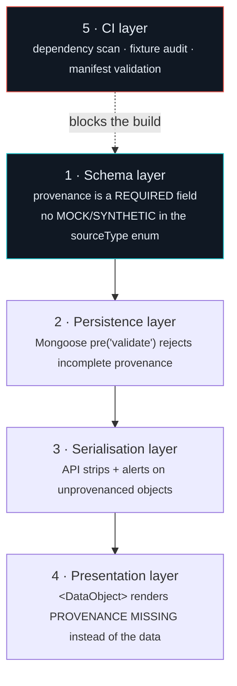

# 13 — Real Data Policy

**Product:** VARUNA
**Problem Statement:** SIH26143
**Document version:** 1.0
**Status:** Binding on all code, all documents, all demonstrations

---

## 13.1 The commitment

> **VARUNA uses no mock data, no fake data, no fabricated data, and no synthetic
> placeholders — anywhere. Not in the product, not in the demo, not in the screenshots, not
> in the reported metrics, and not in the training of any machine learning model.**

Every pixel, every AIS position, every current vector, every wind field, every number
displayed in the interface, and every sample used to train or evaluate a model originates
from a **named, citable, reproducible public source** with a recorded provenance entry.

---

## 13.2 Why this is a technical requirement and not a slogan

This system exists to produce evidence that could inform a regulatory or legal process.
Three consequences follow, and they are the reason this policy is enforced structurally
rather than culturally.

### 13.2.1 A demonstration on fabricated data proves nothing

If a slick is drawn by hand and the vessel tracks are generated by a script, then the
correlation succeeding proves only that the script and the correlator agree. It measures
nothing about the real world. Every metric derived from such a demo is meaningless, and any
metric reported from it is a false claim.

### 13.2.2 Fake data hides exactly the failures that matter

Real data is where the difficulty lives:

| Real-world condition | What synthetic data would erase |
|---|---|
| AIS gaps, spoofed MMSIs, duplicate identities, position jumps | The entire AIS integrity layer would be untested — and F5, our dark-period feature, would have nothing real to detect |
| Look-alikes: low wind, biogenic slicks, rain cells, upwelling | The dominant error mode in this field would be invisible |
| Speckle, thermal noise, incidence-angle variation, border artefacts | The preprocessing chain would appear unnecessary |
| Currents and winds that are coarse, patchy and sometimes simply missing | Degradation paths would never be exercised |
| Slicks that are ambiguous, fragmented, or partially outside the scene | Post-processing thresholds would be tuned to a fantasy |

A system that works on synthetic data and fails on real data is worse than no system,
because it carries unearned confidence.

### 13.2.3 The credibility asymmetry

Building on real data costs time: registrations, quota limits, licence acceptances,
incomplete coverage, awkward formats. Building on generated data is fast and looks
identical in a screenshot.

But the moment an evaluator asks *"is this real?"*, the two paths diverge completely. One
team opens a provenance inspector showing a Copernicus product identifier and a retrieval
timestamp. The other explains. There is no recovery from the second position, and no
possible answer that restores trust.

---

## 13.3 Definitions — what is and is not permitted

### 13.3.1 Permitted

| Category | Definition | Example |
|---|---|---|
| **Real observations** | Data measured by a real sensor or broadcast by a real vessel, obtained from its authoritative distributor | A Sentinel-1 GRD scene from CDSE |
| **Real model output** | Output of an established, peer-reviewed geophysical model, obtained from its official distributor | CMEMS ocean currents; ERA5 winds. These are *models*, but they are the real, citable, operationally-used products, and they are labelled as model-derived in provenance (`OCEAN_MODEL` / `ATMOSPHERIC_MODEL`). |
| **Real expert annotation** | Human labels applied to real imagery by qualified annotators | MKLab/CERTH masks derived from CleanSeaNet verified events |
| **Our own derived values** | Values computed by our pipeline from real inputs, with lineage recorded | A slick polygon's geodesic area; an attribution score. Provenance `sourceType: DERIVED` with `derivedFrom` pointing at the parents. |
| **Label-preserving augmentation** | Geometric or radiometric transforms of *real* imagery that do not invent content | Flips, 90° rotations, random crops, ±10% brightness jitter within observed calibration variance, speckle consistent with the sensor's known statistics |
| **Cached real data** | Real data downloaded once and stored locally for reliability | The pre-staged demo incident in MinIO. Provenance records are the originals. |
| **Captured real fixtures** | Real provider responses saved for deterministic testing | `__fixtures__/real/cdse-search-response.json` with a sibling `.provenance.json` |

### 13.3.2 Forbidden

| Category | Definition | Why it is forbidden |
|---|---|---|
| **Mock data** | Hand-authored objects shaped like real data | Indistinguishable from real data once rendered |
| **Faker-generated data** | Programmatically generated plausible values | Same, at scale |
| **Synthetic imagery** | GAN- or diffusion-generated SAR | The model learns generator artefacts; metrics describe nothing real |
| **Composited slicks** | Real slicks pasted onto real sea backgrounds | Creates a boundary artefact the network trivially learns; metrics become meaningless |
| **Simulated AIS** | Generated vessel tracks | The attribution model learns simulator assumptions instead of vessel behaviour |
| **Physics-simulated training spills** | Slicks generated by a drift model | Circular — the model would learn the drift model we separately rely on |
| **Placeholder values on failure** | Zeros, means, or "typical" values substituted when real data is missing | The specific failure this policy exists to prevent |
| **Silent imputation** | Filling a missing feature with a neutral value | Makes missing data indistinguishable from measured data |
| **Illustrative screenshots** | Mockups presented as system output | Misrepresents capability |
| **Duplication passed off as volume** | Oversampling reported as dataset size | Misrepresents the evidence base |

### 13.3.3 The augmentation boundary, stated precisely

The distinction is whether the transform **preserves the correspondence between the image
and a real physical scene**.

- Flipping a real Sentinel-1 patch produces an image that *could have been* a real
  acquisition of a real, physically plausible sea surface. The label remains valid. This is
  re-sampling reality.
- Pasting a slick from scene A onto sea from scene B produces an image that corresponds to
  **no physical scene that ever existed**, and introduces a compositing seam that the
  network will learn as the definition of "oil". This is fabrication.

The dataset manifest declares both lists explicitly and the training pipeline validates them
against each other ([07_AIML §7.4.5](07_AIML_Specification.md)).

---

## 13.4 Structural enforcement

The policy is enforced at five layers. A violation must be blocked, not merely discouraged.



### Layer 1 — Schema

`sourceType` is a closed enum containing only real-source categories:

```
SATELLITE_SCENE · AIS_ARCHIVE · AIS_API · AIS_STREAM · OCEAN_MODEL ·
ATMOSPHERIC_MODEL · COASTLINE_VECTOR · VESSEL_REGISTRY · HUMAN_ANNOTATION · DERIVED
```

There is deliberately no `MOCK`, `SYNTHETIC`, `TEST`, `DEMO` or `PLACEHOLDER` member. A
developer wanting to insert fabricated data has no valid value to use, and adding one would
be a visible, reviewable change to a policy-critical file.

### Layer 2 — Persistence

```ts
schema.pre('validate', function (next) {
  const p = this.provenance;
  if (!p) return next(new Error('provenance is required'));
  if (!p.provider?.trim() || !p.externalId?.trim() || !p.licence?.trim()) {
    return next(new Error('provenance is incomplete'));
  }
  next();
});
```

### Layer 3 — Serialisation

The `provenanceGuard` middleware inspects outgoing payloads. An object of a
provenance-required type without valid provenance is **removed from the response** and a
`ProvenanceError` is raised. This is treated as a **severity-1 integrity incident**, not an
ordinary error — it means the guarantee has been breached somewhere upstream.

### Layer 4 — Presentation

```tsx
if (!hasValidProvenance(value)) {
  return (
    <div role="alert" className="provenance-missing">
      <strong>PROVENANCE MISSING</strong>
      <p>{typeName} cannot be displayed because it has no verifiable source record.</p>
    </div>
  );
}
```

The failure state is intentionally ugly and unmissable. A broken-looking panel is a better
outcome than an unsourced number rendered beautifully.

### Layer 5 — Continuous integration

See §13.6.

---

## 13.5 Provenance record specification

```jsonc
{
  "sourceType": "SATELLITE_SCENE",
  "provider": "Copernicus Data Space Ecosystem",
  "datasetId": "SENTINEL-1",
  "externalId": "S1A_IW_GRDH_1SDV_20230814T061247_20230814T061312_049823_05FD31_A1B2",
  "retrievedAt": "2026-02-14T09:20:31Z",
  "licence": "Copernicus Sentinel Data 2023",
  "accessUrl": "https://catalogue.dataspace.copernicus.eu/odata/v1/Products('…')",
  "checksum": "sha256:4f3a…",
  "derivedFrom": [],
  "processingManifestId": "pm_01HQ…"
}
```

| Field | Required | Purpose |
|---|---|---|
| `sourceType` | ✅ | Category; closed enum |
| `provider` | ✅ | Who distributed it |
| `datasetId` | ✅ | Which dataset/collection |
| `externalId` | ✅ | **The identifier an evaluator can use to find the same data themselves** |
| `retrievedAt` | ✅ | When we obtained it |
| `licence` | ✅ | Licence and required attribution |
| `accessUrl` | — | Direct link where one exists |
| `checksum` | — | SHA-256 of the raw artefact |
| `derivedFrom` | ✅ for `DERIVED` | Full lineage graph |
| `processingManifestId` | — | The exact processing chain applied |

`externalId` is the load-bearing field. It is what converts "trust us" into "check for
yourself."

### 13.5.1 Lineage

Derived objects reference their parents, forming a directed acyclic graph:

```
CandidateVessel
  └── derivedFrom: [ OriginEstimate, VesselTrack, SpillDetection ]
        ├── OriginEstimate  ← derivedFrom: [ SpillDetection, CMEMS currents, ERA5 winds ]
        ├── VesselTrack     ← derivedFrom: [ AisPosition batch ]
        └── SpillDetection  ← derivedFrom: [ SatelliteScene, model artefact SHA-256 ]
```

Any candidate score can therefore be traced back to a Copernicus product identifier, a
CMEMS dataset ID, an AIS archive file, and a specific set of model weights. The report's
Data Provenance appendix prints this graph.

---

## 13.6 CI enforcement

```bash
#!/usr/bin/env bash
# scripts/check-real-data-policy.sh
# Fails the build on any real-data policy violation.
set -euo pipefail
FAIL=0

echo "▸ 1/6  Fake-data libraries must not be runtime dependencies"
if jq -e '.dependencies | keys[] |
     select(test("faker|chance|casual|falso|mockjs"))' \
     apps/*/package.json services/*/package.json >/dev/null 2>&1; then
  echo "  ✗ A fake-data library is declared as a runtime dependency."
  FAIL=1
fi

echo "▸ 2/6  Forbidden provenance source types must not appear in source"
if grep -rniE "sourceType\s*[:=]\s*['\"](MOCK|SYNTHETIC|FAKE|DEMO|PLACEHOLDER|TEST)['\"]" \
     --include='*.ts' --include='*.tsx' --include='*.py' apps services packages; then
  echo "  ✗ A forbidden sourceType literal is present."
  FAIL=1
fi

echo "▸ 3/6  Every test fixture must carry a provenance sibling"
while IFS= read -r f; do
  [[ -f "${f%.json}.provenance.json" ]] || { echo "  ✗ $f has no .provenance.json"; FAIL=1; }
done < <(find . -path '*/__fixtures__/real/*.json' ! -name '*.provenance.json')

echo "▸ 4/6  No fixtures outside __fixtures__/real/"
if find . -path '*__fixtures__*' -not -path '*__fixtures__/real*' -name '*.json' | grep -q .; then
  echo "  ✗ Fixtures exist outside __fixtures__/real/."
  FAIL=1
fi

echo "▸ 5/6  Dataset manifest must declare real data only"
python3 -c "
import sys, yaml
m = yaml.safe_load(open('data/manifests/dataset_manifest.yaml'))
bad = False
for e in m['entries']:
    for k in ('provider','citation','licence','access_url','retrieved_at','sha256'):
        if not e.get(k):
            print(f'  ✗ {e[\"id\"]}: missing {k}'); bad = True
    if not e.get('real_data') or e.get('synthetic_content') != 'none':
        print(f'  ✗ {e[\"id\"]}: declares non-real content'); bad = True
overlap = set(m['augmentation']['permitted']) & set(m['augmentation']['forbidden'])
if overlap:
    print(f'  ✗ forbidden augmentation in permitted list: {overlap}'); bad = True
sys.exit(1 if bad else 0)
" || FAIL=1

echo "▸ 6/6  Provenance-required models must apply the provenance plugin"
for model in SatelliteScene SpillDetection VesselTrack OriginEstimate CandidateVessel Vessel; do
  grep -rq "provenancePlugin" "apps/api/src/modules/"*"/"*"$model"* 2>/dev/null \
    || { echo "  ✗ $model does not apply provenancePlugin"; FAIL=1; }
done

[[ $FAIL -eq 0 ]] && echo "✓ Real-data policy: PASS" || { echo "✗ Real-data policy: FAIL"; exit 1; }
```

This script is a required status check on every pull request.

---

## 13.7 Testing without fake data

The most common objection to this policy is "but how do you write tests?"

| Test need | How we meet it without fabrication |
|---|---|
| Deterministic API responses | **Captured real responses.** A real CDSE search is executed once, saved to `__fixtures__/real/`, and replayed. Provenance is the original request's. |
| Edge cases (empty results, 429, 503) | Captured real error responses, plus HTTP-layer fault injection. We simulate the *transport failure*, never the *data*. |
| Large-volume performance testing | A **real** AIS slice from Marine Cadastre or the Danish DMA. Real data is more adversarial than anything we would generate — irregular intervals, duplicates, jumps. |
| Geodesy correctness | **Known-answer tests** against published reference values (great-circle distances between real named cities; areas of defined graticule cells). These are mathematical constants, not fabricated observations. |
| UI component tests | Real captured API payloads. A component test for `EvidenceWaterfall` uses a real scored candidate from the demo incident. |
| Model unit tests | Real tiles from the training set, with assertions on output shape, value ranges and determinism — not on invented ground truth. |
| Empty and error states | Genuinely empty real responses. An AOI in the middle of the Pacific with a two-hour window really does return zero scenes. |

**The principle:** we simulate *failures of transport and infrastructure*, never *the
content of observations*.

---

## 13.8 What we do when data is genuinely unavailable

| Situation | Response | Never |
|---|---|---|
| No satellite coverage for the date | Widen the window; state the gap in the report | Substitute a different date's scene and present it as the incident |
| No AIS for the region | Return `NO_AIS_COVERAGE`, list every source queried with its coverage window | Generate plausible vessel tracks |
| No current data | Run `DEGRADED` in footprint-proximity mode with a persistent banner | Assume zero drift silently, or invent a current field |
| No wind data | Drop the wind term, widen intervals, state it | Assume a "typical" wind speed |
| A feature cannot be measured | Mark `MISSING`; renormalise over measured features; display the row as `NOT MEASURED` | Impute a neutral value |
| Fewer than 6 measurable features | Force `INSUFFICIENT_EVIDENCE` | Present a ranking anyway |
| Training dataset request not yet approved | Train on secondary real datasets; state the reduced training set | Generate synthetic slicks |
| Too few labels to calibrate | Ship with every score labelled `UNCALIBRATED` | Fabricate validation cases to produce a calibration curve |
| A dataset's provenance cannot be established | Reject the dataset | Use it and hope no one asks |

Every row has the same shape: **an explicit, labelled absence** rather than a
plausible-looking value.

---

## 13.9 Application to documentation and presentation

This policy governs the documents and the pitch as much as the code.

| Rule | Consequence |
|---|---|
| No screenshot may show fabricated data | Every screenshot in every deliverable is of the system running on the real demo incident |
| No metric may be quoted that was not measured | Targets are labelled as targets; measured results are labelled with the split they were measured on |
| No competitor claim without a citation | [09_RESEARCH](09_RESEARCH_Competitive_Analysis.md) cites primary sources and flags figures for re-verification before submission |
| No performance number without a measurement method | Budgets in [02_TRD §2.10](02_TRD_Technical_Requirements.md) state the hardware and workload |
| Capabilities not yet built are labelled Phase 2 or Phase 3 | Consistently, in every document |
| Limitations are stated in the documents, not only when asked | [07_AIML §7.9](07_AIML_Specification.md), [09_RESEARCH §9.8](09_RESEARCH_Competitive_Analysis.md) |

---

## 13.10 The demo-staging exception, stated explicitly

`pnpm run stage:demo` downloads the demo incident's real scenes, real AIS slice, real
currents and real winds into local MinIO and MongoDB ahead of time.

**This is caching, not fabrication.** The data is byte-identical to what the providers
serve, the provenance records are the originals, and the checksums match. It exists so a
live demonstration does not depend on provider uptime, request queues, or quota.

**The boundary:** pre-staging real data is permitted and encouraged. Pre-computing results
and replaying them as though they were computed live is **not** — the pipeline runs for
real during the demonstration, on the pre-staged real inputs.

---

## 13.11 Team acknowledgement

Every contributor confirms:

```
[ ] I have read the Real Data Policy.
[ ] I will not introduce mock, fake, synthetic or placeholder data into any part of
    this system, including tests, demos, screenshots, and model training.
[ ] I will record complete provenance for every data source I add.
[ ] If real data is unavailable, I will implement an explicit UNAVAILABLE or DEGRADED
    state rather than a default value.
[ ] I understand that a provenance violation is a severity-1 defect, not a minor bug.
[ ] I will not quote a metric I have not measured, in code, documents, or presentation.
```

---

## 13.12 The one-sentence version

> If you cannot name where a number came from, it does not go on the screen.
