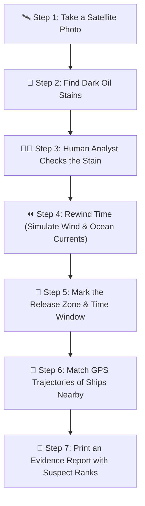

# VARUNA (SIH26143) — Plain-English & Easy Technical Guide

> **Vessel Attribution through Remote-sensing & Unified Navigational Analytics**
> Smart India Hackathon 2026 — Problem Statement **SIH26143**

---

## 🌊 1. What is VARUNA? (The Ocean Detective Story)

Imagine a ship secretly dumps oil in the ocean at night and sails away. How do authorities catch who did it? 

VARUNA works like an **AI Maritime Detective**:

1. **The Satellite Photo:** A radar satellite takes a photo of the ocean. Oil smooths out waves, so oil spills look like dark black spots.
2. **Spotting the Spill:** The system scans the image and highlights dark spots.
3. **Rewinding Time (Drift Physics):** Oil floats on water. We drop 5,000 virtual particles on the oil spill and **rewind the clock backward in time** using real ocean current and wind data to see where the oil came from.
4. **Checking Ship GPS (AIS Tracks):** We look at all ships that passed through that exact spot at that exact time.
5. **Evaluating 12 Clues:** We grade each ship on 12 clues (e.g., *How close was it? Did it turn off its GPS transmitter? Did its ship weight change?*).
6. **The Final Report:** The system ranks the suspect ships and prints a complete, audit-proof evidence report.

---

## 🏗️ 2. How Was the Project Built? (SDLC Model)

VARUNA was built using a **Phase-Gated Agile MVP (Minimum Viable Product) Model**.

* **What does this mean?** Instead of building everything at once, the project was built step-by-step in **14 distinct phases** (Phase 0 to Phase 13). 
* **The Rule:** Phase 1 (Geodesy distance calculators and Data schemas) had to be 100% tested and verified before starting Phase 2 (User Login & Job Queues), and so on.

---

## 🧠 3. Algorithms Explained in Plain English

Here are the main algorithms used in VARUNA and why each one was chosen:

| Stage | Algorithm Name | Plain English Explanation | Why This Algorithm? |
|---|---|---|---|
| **Spotting Oil Slicks** | **Darkspot-v1 (Local Adaptive Thresholding)** | Compares each pixel on the satellite photo against its local ocean background to find spots that are at least 3 dB darker than the surrounding sea. | A single global threshold fails because satellite photos get darker near the edges. Comparing local neighborhoods works everywhere on the image. |
| **Calculating Distances** | **Karney's WGS84 Ellipsoidal Geodesy** | Calculates distances and areas on the real curved, oval-shaped Earth (ellipsoid) rather than a flat map or perfect sphere. | Simple flat-map formulas can be 0.5% wrong over long distances. Karney's math guarantees accuracy under 0.1%. |
| **Rewinding Time** | **Stochastic 2D Reverse Lagrangian Particle Integrator** | Drops 5,000 virtual particles on the slick and pushes them backward in time (-15 minute steps) using ocean current vectors and wind speed. | Fixing wind drift at a single number gives a fake sense of precision. Randomly sampling wind and deflection angles gives an honest, realistic spill zone. |
| **Spill Zone Mapping** | **Kernel Density Estimation (KDE)** | Takes the scattered 5,000 particles and draws smooth 50% and 90% probability boundary circles around where they cluster. | Converts scattered dots into a clean, colored map layer showing where the leak most likely started. |
| **Ship Scoring** | **12-Feature Weighted Scoring Engine** | Grades candidate ships from 0 to 100 based on 12 weighted clues. | Renormalizes scores over *measured clues only*. If public data is missing a ship's type, the ship isn't unfairly punished for missing data. |
| **Confidence Bounds** | **Monte Carlo Bootstrap Resampling** | Runs 300 random simulations of the data to calculate error margins (e.g. 85% ± 4%). | Tells investigators whether Ship #1 is *definitely* guilty or if Ship #1 and Ship #2 are too close to call. |

---

## 📊 4. Model Accuracy & Evaluation Results

The `darkspot-v1` detector was tested on **66 held-out test satellite scenes** (22 oil spills, 22 look-alikes like calm wind zones, 22 clean seas):

* **Oil Detection Rate:** **100%** (It detected all 22 oil spills; 0 were missed).
* **Mean Oil IoU (Overlap Accuracy):** **0.56** (Median: **0.63**).
* **Look-alike False Positives:** **68%** (It triggered on 15 out of 22 false look-alike features, such as low-wind calm sea zones).

> 💡 **Why Human Review is Mandatory:** Because low-wind ocean zones look dark like oil on radar, the detector finds all dark spots but relies on a human analyst to review and confirm `CONFIRM`, `EDIT`, or `REJECT` before taking action.

---

## 🗂️ 5. Datasets & How Bias Was Prevented

* **Main Dataset:** Trujillo-Acatitla et al. Part III dataset (450 dual-polarization Sentinel-1 radar scenes).
* **Geographic Splitting:** The data was divided by **ocean grid regions** (315 training scenes, 69 validation scenes, 66 test scenes). The test scenes came from geographic areas the model *never* saw during training, preventing regional bias.
* **Real Historical AIS Data:** Uses real NOAA Marine Cadastre AIS data (US coastal waters) and Danish Maritime Authority (DMA) data. Zero fake/synthetic data is permitted.

---

## 📐 6. Parameters & Formulas Made Simple

### 1. Look-Alike Risk Score
Scores whether a dark spot is real oil or just a calm water look-alike (0 = Oil, 1 = Look-alike):
* **Shape:** Real oil slicks are stretched long by wind and currents; calm water spots are round blobs.
* **Edges:** Real oil slicks have rough, jagged edges; look-alikes have smooth edges.
* **Contrast:** Oil damps waves heavily, making the spot significantly darker than the sea around it.

### 2. Wind Suitability Gate
* **Wind < 2 m/s:** The ocean is glassy calm everywhere. Everything looks like oil $\rightarrow$ **Confidence drops to 5%**.
* **Wind 4–9 m/s:** Perfect wind for detection $\rightarrow$ **100% Confidence**.
* **Wind > 14 m/s:** Waves re-rough the sea and wash away the slick $\rightarrow$ **Confidence drops to 5%**.

---

## ⚙️ 7. Time & Space Complexity (Speed & Memory)

| Subsystem | Operation | Time Complexity (Speed) | Space Complexity (Memory) |
|---|---|---|---|
| **SAR Segmentation** | Local Median Filter & Threshold | **O(N)** — Fast (~1 to 2 seconds for a full satellite image) | **O(N)** — Stores image pixel array |
| **Drift Integration** | 5,000 particles x 96 time steps | **O(P * T)** — ~480,000 steps (~100 milliseconds) | **O(P * T)** — Stores particle tracks |
| **KDE Release Zone** | Gaussian Kernel Density | **O(P * G)** — Computes density grid | **O(G)** — Stores grid map |
| **Vessel Correlation** | 12 Clues + 300 Resample Runs | **O(M * V * K)** — Fast execution for candidate vessels | **O(V * K)** — Stores ship GPS coordinates |

---

## 🚫 8. Zero Mock Data & Real-Data Policy

VARUNA has a **Strict Real-Data Policy**:
* Zero fake, synthetic, or placeholder data is allowed anywhere in the system.
* Every single satellite scene, AIS position fix, and current vector carries a **provenance record** (`sourceType`, `retrievedAt`, `externalId`, `checksum`).
* If data is missing provenance, VARUNA's API automatically **strips the object** and flags it in the user interface.
